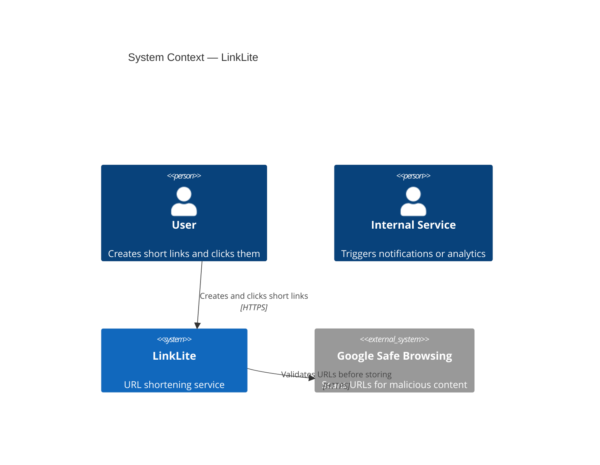

# Context Diagram — LinkLite

```mermaid
C4Context
  title System Context — LinkLite
  Person(user, "User", "Creates short links and clicks them")
  Person(service, "Internal Service", "Triggers notifications or analytics")
  System(linklite, "LinkLite", "URL shortening service")
  System_Ext(safebrowsing, "Google Safe Browsing", "Scans URLs for malicious content")
  Rel(user, linklite, "Creates and clicks short links", "HTTPS")
  Rel(linklite, safebrowsing, "Validates URLs before storing", "HTTPS")
```