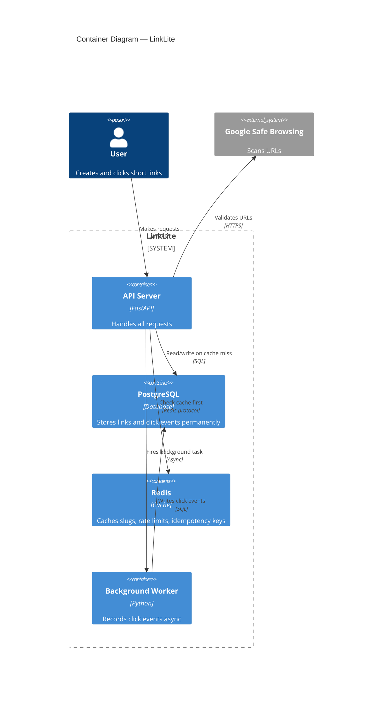

# Container Diagram — LinkLite

```mermaid
C4Container
  title Container Diagram — LinkLite

  Person(user, "User", "Creates and clicks short links")

  System_Boundary(linklite, "LinkLite") {
    Container(api, "API Server", "FastAPI", "Handles all requests")
    Container(db, "PostgreSQL", "Database", "Stores links and click events permanently")
    Container(cache, "Redis", "Cache", "Caches slugs, rate limits, idempotency keys")
    Container(worker, "Background Worker", "Python", "Records click events async")
  }

  System_Ext(safebrowsing, "Google Safe Browsing", "Scans URLs")

  Rel(user, api, "Makes requests", "HTTPS")
  Rel(api, cache, "Check cache first", "Redis protocol")
  Rel(api, db, "Read/write on cache miss", "SQL")
  Rel(api, safebrowsing, "Validates URLs", "HTTPS")
  Rel(api, worker, "Fires background task", "Async")
  Rel(worker, db, "Writes click events", "SQL")
```