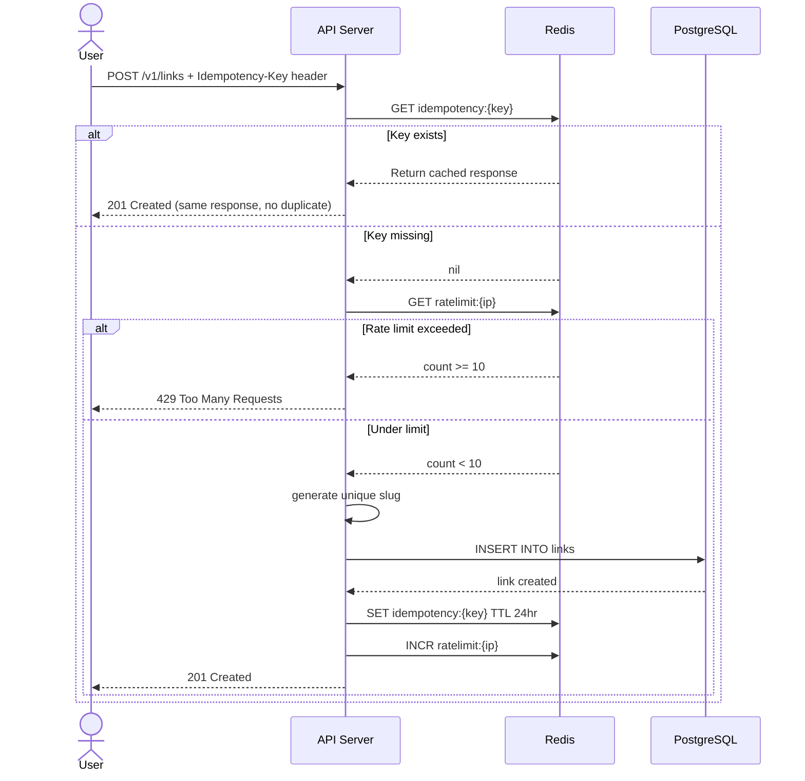

# Create Link Sequence — with idempotency and rate limiting

```mermaid
sequenceDiagram
  actor User
  participant API as API Server
  participant Redis
  participant DB as PostgreSQL

  User->>API: POST /v1/links + Idempotency-Key header

  API->>Redis: GET idempotency:{key}
  alt Key exists
    Redis-->>API: Return cached response
    API-->>User: 201 Created (same response, no duplicate)
  else Key missing
    Redis-->>API: nil
    API->>Redis: GET ratelimit:{ip}
    alt Rate limit exceeded
      Redis-->>API: count >= 10
      API-->>User: 429 Too Many Requests
    else Under limit
      Redis-->>API: count < 10
      API->>API: generate unique slug
      API->>DB: INSERT INTO links
      DB-->>API: link created
      API->>Redis: SET idempotency:{key} TTL 24hr
      API->>Redis: INCR ratelimit:{ip}
      API-->>User: 201 Created
    end
  end
```