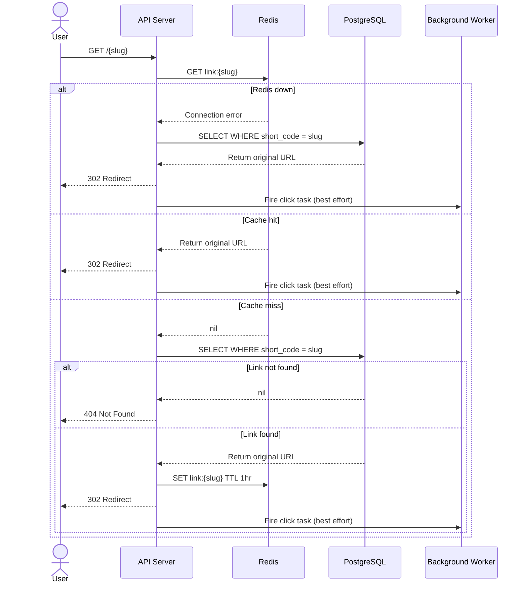

# Redirect Sequence — cache hit, miss, and Redis down

```mermaid
sequenceDiagram
  actor User
  participant API as API Server
  participant Redis
  participant DB as PostgreSQL
  participant BG as Background Worker

  User->>API: GET /{slug}
  API->>Redis: GET link:{slug}

  alt Redis down
    Redis-->>API: Connection error
    API->>DB: SELECT WHERE short_code = slug
    DB-->>API: Return original URL
    API-->>User: 302 Redirect
    API->>BG: Fire click task (best effort)
  else Cache hit
    Redis-->>API: Return original URL
    API-->>User: 302 Redirect
    API->>BG: Fire click task (best effort)
  else Cache miss
    Redis-->>API: nil
    API->>DB: SELECT WHERE short_code = slug
    alt Link not found
      DB-->>API: nil
      API-->>User: 404 Not Found
    else Link found
      DB-->>API: Return original URL
      API->>Redis: SET link:{slug} TTL 1hr
      API-->>User: 302 Redirect
      API->>BG: Fire click task (best effort)
    end
  end
```