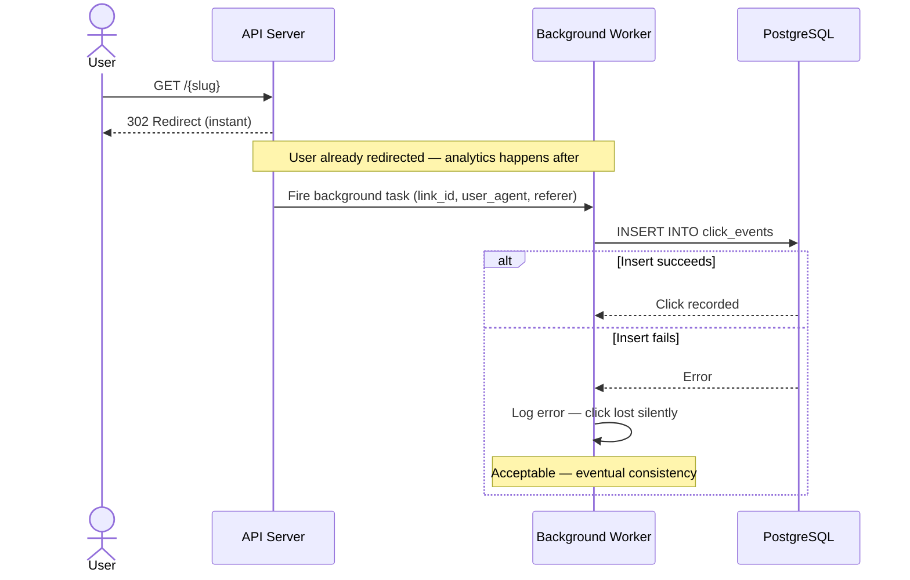

# Async Analytics Flow

```mermaid
sequenceDiagram
  actor User
  participant API as API Server
  participant BG as Background Worker
  participant DB as PostgreSQL

  User->>API: GET /{slug}
  API-->>User: 302 Redirect (instant)

  Note over API,BG: User already redirected — analytics happens after

  API->>BG: Fire background task (link_id, user_agent, referer)

  BG->>DB: INSERT INTO click_events
  alt Insert succeeds
    DB-->>BG: Click recorded
  else Insert fails
    DB-->>BG: Error
    BG->>BG: Log error — click lost silently
    Note over BG: Acceptable — eventual consistency
  end
```