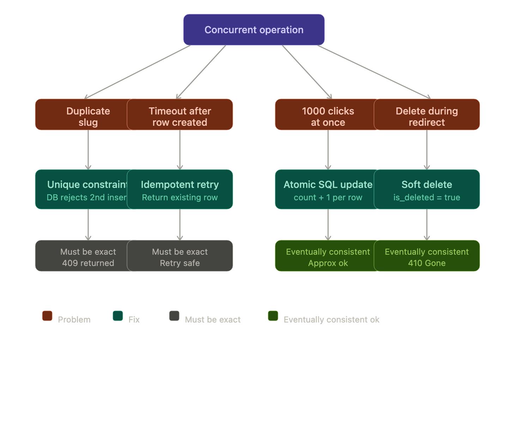
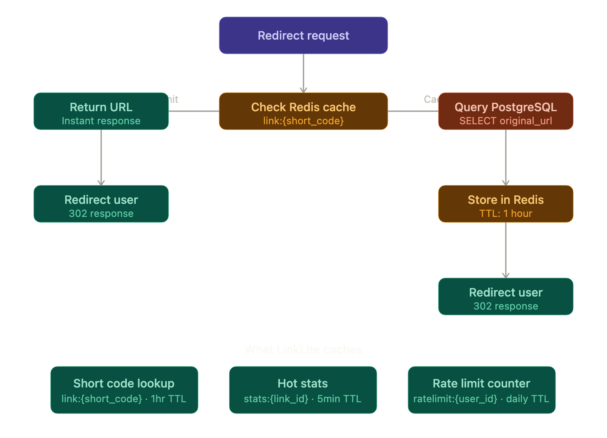
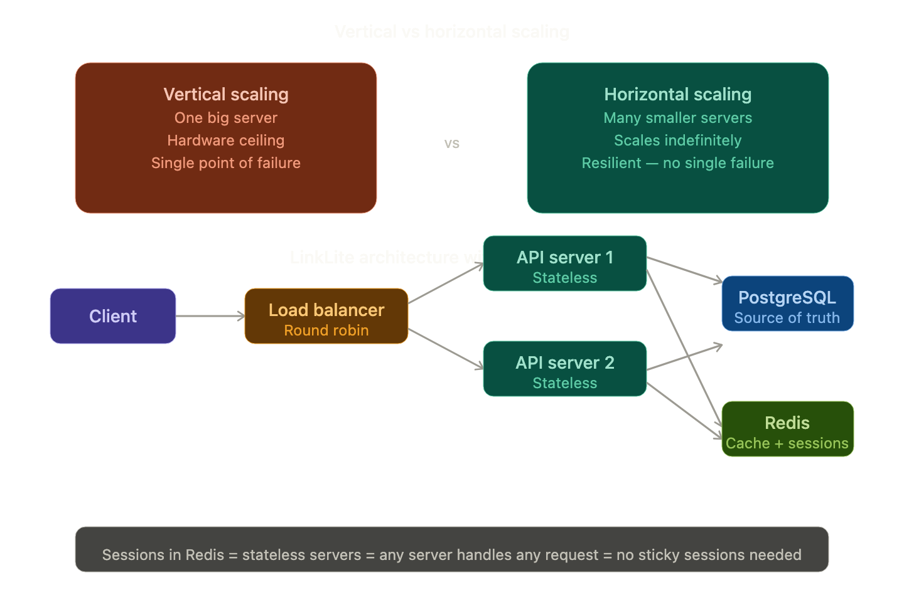
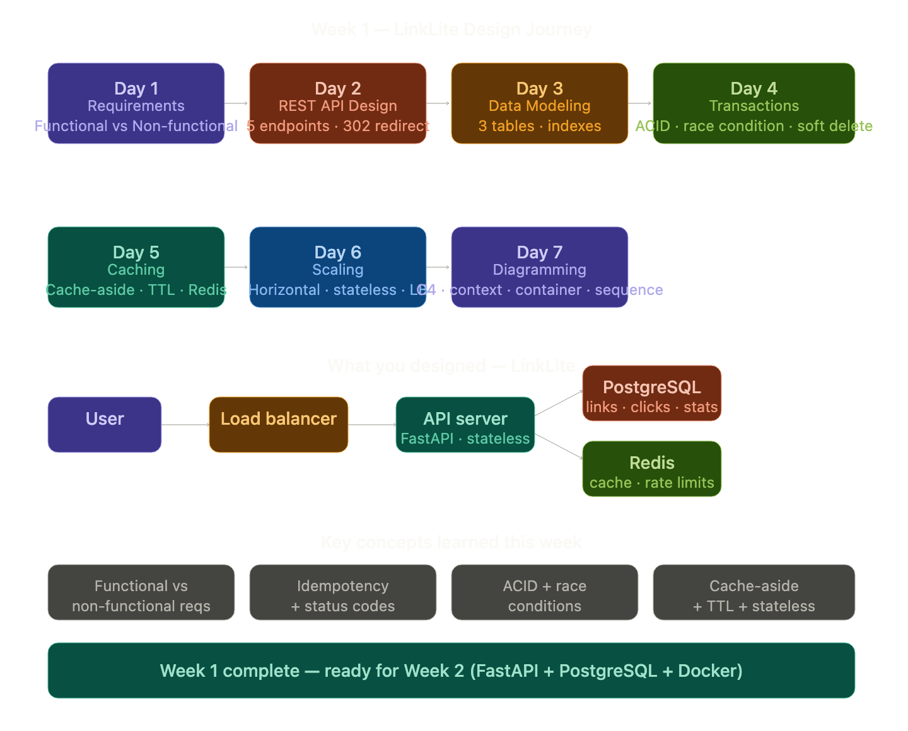

started day 1 of system design bootcamp - had no idea what a url shortener
even was before today. watched the bytebyteGo video and it clicked pretty fast.
learned the difference between functional and non-functional requirements -
basically what a system does vs how well it does it. figured out that redirects
need to be fast because high read traffic can break user experience at scale.
also learned that no rate limiting = one user can crash your whole db.
small things that teams forget but actually matter a lot.

day 2 - learned what a REST api is - REST is a specific style of api
that uses http methods like GET POST DELETE, urls as resource names,
and status codes as responses. its the most common style used in web backends.biggest thing that clicked today was
status codes - they are not random numbers, every range means something.
2xx worked, 3xx go somewhere else, 4xx you messed up, 5xx server broke.

also learned why 302 and not 301 for redirects - 301 caches in the browser
forever so you lose every click from analytics. 302 always checks the server
first so you stay in control.

pagination was new - never return all rows at once, always break it into
pages otherwise the server breaks under load.

designed 5 endpoints for linklite today - create, read, redirect, stats, delete.
starting to see how each design decision has a reason behind it.

day 3 - data modeling and indexes. learned that designing tables is not
just about storing data - its about knowing how that data will be searched
and fetched later.

biggest thing that clicked today - indexes are not free. every index you
add slows down writes because the db has to update the index every time
you insert or update a row. so you only index columns you actually search by.

learned why click_events will become the heaviest table in linklite -
every single click adds a row. billions of rows over time. thats why
daily_link_stats exists - pre-calculate once, read instantly.

also learned that storing raw ip addresses is a privacy violation -
you hash it first so you can detect duplicate clicks without identifying
the actual person.

three tables designed today - links, click_events, daily_link_stats.
starting to see how each table serves a specific purpose and how they
connect to each other through foreign keys.

 - Day-4

day 4 - transactions and correctness. learned that ACID is not just a
concept - it directly maps to real problems in linklite.

biggest thing that clicked today - not every problem needs a transaction.
slug conflicts are handled by a unique constraint, click counts are handled
by atomic sql updates. transactions are for when partial writes would leave
the database in a broken state.

learned three new terms that sound scary but aren't - race condition is just
two things editing the same data at the same time and one change getting lost.
orphan row is data that got created but the user never knew it succeeded.
soft delete is setting is_deleted = true instead of actually removing the row.

also learned that eventual consistency is okay for some data - click counts
being slightly off is fine. but slug ownership and link creation must be exact

- user needs to know for sure if their link exists or not.

starting to think about data in two buckets - what must be correct instantly
and what can be slightly delayed.

Day- 5

day 5 - caching basics. learned that cache-aside is a reactive approach

- you don't pre-load the cache, you populate it on the first request and
  serve everyone else from there.

biggest thing that clicked today - cache is not free storage. redis keeps
everything in memory so it's fast but expensive and not permanent. if redis
restarts without a db backup, your data is gone. that's why raw click events
stay in postgresql and only summaries go into cache.

learned what ttl is - a timer on every cached item. without ttl, stale data
lives forever. a deleted link could still redirect users to the wrong place
for days.

designed 3 cache entries for linklite - short code lookup, hot stats summary,
and rate limit counters. each one has a clear key, ttl, and invalidation rule.

rule that stuck: cache what gets read often and changes rarely.
don't cache what gets written constantly or must always be exact.

Day - 6 

day 6 - scaling basics. learned the difference between vertical and
horizontal scaling. vertical means bigger machine - easy but has a
hardware ceiling and one point of failure. horizontal means more machines

- resilient, scales indefinitely, but requires the app to be stateless first.

biggest thing that clicked today - stateless doesn't mean the app has no
state. it means state lives somewhere shared like redis, not on the server
itself. that's what makes it possible for any server to handle any request.

learned 3 load balancing algorithms - round robin takes turns, least
connections picks the least busy server, ip hashing sends the same user
to the same server every time.

sticky sessions are unnecessary for linklite because the app is stateless.
sessions live in redis so it doesn't matter which server you hit.

redirects are easy to scale - stateless cache reads. analytics are hard
to scale - heavy aggregation across millions of rows. that difference matters
when designing for growth.

day 7 - diagramming with c4 model. learned that diagrams have levels -
you don't draw everything at once. context level shows your system and
what's around it. container level zooms in and shows what's inside.

drew three diagrams for linklite today - context, container, and the
redirect sequence flow. the sequence diagram made the cache-aside pattern
click visually - cache hit means db never gets touched, cache miss means
db gets queried and result gets stored for next time.

biggest takeaway - diagrams are a communication tool. the goal is for
anyone to look at it and understand the system without reading a single
line of code.

don't need to memorize mermaid syntax - need to know what to draw
and why. syntax is always a lookup away.

Week 1 — LinkLite Design Journey

day 13 - rate limiting. learned that without a limit one user can create
millions of links and crash the database. the fix is simple - store a
counter in redis with a daily ttl and reject requests once the limit is hit.

redis makes this cheap - incrementing a counter is one operation,
reads are instant. no db involved at all.

tested it by firing 11 requests in a loop - first 10 succeeded,
11th got 429 rate limit exceeded. exactly what we designed on day 1
when we said "no rate limit = one user crashes your db".

the limit is set to 10 for testing. in production this would be
higher - maybe 100 or 1000 per day depending on the use case.

starting to see how everything from week 1 docs is becoming real code now.
requirements → api design → data model → cache → rate limiting.
its all connected.

day 15 - observability. learned that observability means being able to
ask questions about your system from the outside without digging into code.
three signals make this possible - logs, metrics and traces.

before today if something broke in linklite i would only know if i was
watching the terminal. in production nobody watches terminals - the system
has to tell you automatically.

added structured logging to linklite today. every request now logs
request_id, method, path, status code and duration in milliseconds.

biggest moment - saw cache miss vs cache hit latency in real numbers for
the first time. cache miss took 25.5ms hitting postgres. cache hit took
3.69ms hitting redis only. cache is 7x faster. that's not theory anymore,
that's measured from my own system.

request_id is important - in production when something fails you need to
trace that one specific request through all your logs. without a unique id
per request you're searching through thousands of lines blind.

day 16 - slos and alerts. learned the difference between sli, slo and sla.
sli is what you measure, slo is the target, sla is the contract with consequences.

biggest thing that clicked - not everything needs to wake you up at 3am.
you need to be deliberate about what's a real emergency vs what can wait
until morning. waking someone up for a non-emergency is as bad as missing
a real one.

defined 3 slos for linklite today. redirect success rate is the most
critical - if that drops below 99.9% every short link in the world using
linklite is broken. that's a 3am call. create link success rate is less
critical - users are inconvenienced but existing links still work.

latency slo came directly from real data - cache hit was 3.69ms today.
set p95 target at under 50ms. if it ever hits 500ms consistently that's
when you page someone.

the pattern: measure something meaningful, set a target, decide what
happens when you miss it. simple framework but most teams skip it until
something breaks in production.

Day 17 - idempotency and retries. learned that POST requests are not 
safe to retry by default. if a request times out after the db row is 
created but before the response is sent - retrying creates a duplicate.
that's the orphan row problem from day 4 finally getting a real fix.

stripe uses idempotency keys for payments - if a payment request times 
out you don't want to charge the customer twice. same exact problem in 
linklite, just less money involved.

the fix is simple - client generates a unique key, sends it as a header 
every time. server checks redis first. if key exists return the stored 
response. if not create the link and store the result.

tested it today - sent the same request twice with the same idempotency 
key. both returned the exact same short code. no duplicate row created 
in the database.

key stored in redis with 24hr ttl - same as rate limit counter. 
redis is doing a lot of heavy lifting in this system. caching, 
rate limiting, idempotency - all redis.

Day 18 - api security and abuse. learned the owasp api top 10 - 
the most common ways apis get attacked or misused in production.

most important thing today wasn't the theory - it was finding a real 
security gap in linklite. no .gitignore meant .env with database 
credentials could have been pushed to github at any point. fixed that 
immediately. small thing, big consequences if missed.

mapped all 5 risks to linklite specifically. broken auth is the biggest 
gap right now - anyone can create, delete or view any link with zero 
authentication. acceptable for a local demo, not acceptable for production.

rate limiting already built on day 13 protects against unrestricted 
resource consumption on the create endpoint. but stats endpoint still 
has no limit - that's the next thing to fix.

security isn't a feature you add at the end. every endpoint you build 
without thinking about who should access it and how much they can use it 
is a gap. day 18 is the first time i looked at linklite like an attacker 
instead of a builder.

Day 19 - consistency models. learned the difference between strong 
consistency and eventual consistency. strong consistency means the system 
behaves as if it's not distributed at all - every client sees the same 
data at the same time. eventual consistency means nodes catch up over time 
but can temporarily return different values.

the cap theorem was the big concept today - in a distributed system you 
can only guarantee 2 of 3: consistency, availability, partition tolerance.
network partitions always happen so you're always choosing between 
consistency and availability. that's why you can't have everything.

mapped linklite to both models. short_code uniqueness needs strong 
consistency - two users can't share a slug, must be resolved instantly.
click counts are eventually consistent - losing one click out of thousands 
is acceptable, counts catch up via daily aggregation.

the pattern: ask "what breaks if this data is wrong or delayed?" 
if the answer is "users get the wrong page" - strong consistency.
if the answer is "the count is off by a few" - eventual is fine.

this is the same framework from day 4 but now i have the proper vocabulary
for it. strong consistency, eventual consistency, CAP theorem.

Day 20 - failure modes and resilience. learned that knowing your system 
works is not enough. you need to know what happens when parts of it break.

did a real failure drill today - stopped redis while linklite was running 
and tried to redirect. before the fix it crashed with 500 internal server 
error. every short link would have been broken for every user.

the fix was simple - wrap every redis call in try/except. if redis is down, 
log the error and fall back to postgres. user still gets their redirect, 
just slightly slower. 20ms instead of 3ms. slower is always better than broken.

after the fix - redis down, users see nothing wrong. redirects still work 
from postgres. when redis comes back up the cache rebuilds automatically 
on the next request. zero manual intervention needed.

biggest lesson today - never let your cache layer crash your core user flow. 
redis is a performance optimization, not a dependency. postgres is the 
source of truth. design your system so it degrades gracefully when 
optimizations fail.

the failure drill made everything from week 1 real. we talked about 
failure modes on paper on day 4. today we actually broke the system 
and fixed it. that's the difference between knowing and understanding.

Day 22 - notification service design. first time designing a system 
from scratch without any guidance on what the system should look like.
just applied the same framework from week 1 to a completely different problem.

biggest thing that clicked - a notification service doesn't decide when 
to send notifications. it responds to events from other services. payment 
service says "charge succeeded", notification service sends the email. 
clean separation of concerns.

two tables instead of one - notifications stores the request, 
delivery_attempts stores every send attempt separately. one notification 
can have multiple attempts if the provider fails. tracking each attempt 
gives you a full audit trail of what happened and when.

provider failover was the most interesting design decision - if sendgrid 
goes down you can't just stop sending emails. you automatically switch to 
mailgun, then aws ses, then dead letter queue. the system degrades 
gracefully instead of failing completely. same pattern as the redis 
fallback in linklite.

the framework transfers. requirements → api → schema → queue → 
failure modes. same structure, different system. that's the point of 
week 4.

Day 23 - notification delivery guarantees. learned the three delivery 
semantics - at-most-once, at-least-once, and exactly-once.

exactly-once sounds ideal but is extremely hard to achieve in distributed 
systems. in practice you choose between at-most-once and at-least-once 
depending on what failure is more acceptable.

for payment receipts losing the notification is worse than a duplicate - 
at-least-once. for marketing emails a duplicate is worse than missing one - 
at-most-once. the right choice depends on the use case not a blanket rule.

the timeout problem is the tricky one - provider accepts the message but 
confirmation never arrives. system retries. user gets it twice. fix is a 
dedupe key in redis - same pattern as idempotency key in linklite. 
if already sent, skip. simple but effective.

dead letter queue was the other key concept - after all retries fail, 
message goes here instead of disappearing. nothing is lost, just delayed. 
engineering team gets alerted and can manually replay. graceful degradation 
again - same pattern keeps showing up everywhere.

starting to see that distributed systems have a small set of core patterns 
that repeat across every system. retry with backoff, dedupe keys, dead 
letter queues, graceful fallback. learn the patterns once, apply everywhere.

Day 24 - notification service slos and abuse controls. applied the same 
slo and security frameworks from week 3 to a completely different system. 
starting to feel like a repeatable process instead of one-off exercises.

three slos defined - delivery success rate, delivery latency, and dead 
letter queue size. the third one was new - monitoring queue size is how 
you catch silent failures. messages piling up in the dead letter queue 
means something is broken upstream even if the api is still returning 200s.

circuit breaker was the most interesting concept today. works exactly like 
a physical circuit breaker - too many failures trips the circuit, requests 
stop hitting the failing provider automatically, system routes to backup. 
after a cooldown period it resets and tries again. no human intervention needed.

abuse controls map directly to linklite patterns - per-user rate limiting 
is the same redis counter pattern from day 13, just scoped differently. 
per-service budget limits are new - important when multiple internal 
services share one notification system. one runaway service shouldn't be 
able to spam all users and exhaust the daily budget.

the pattern across week 4 is becoming clear - every system needs the same 
things: slos to measure reliability, rate limits to prevent abuse, circuit 
breakers for external dependencies, dead letter queues for failure recovery. 
learn the patterns once, apply everywhere.

Day 25 - final diagrams for linklite. updated all diagrams to reflect 
everything built over 4 weeks - redis failure handling, idempotency, 
rate limiting, async click tracking. the diagrams from day 7 were just 
outlines. these ones tell the full story.

the redirect sequence diagram was the most complex - three separate paths 
in one diagram. redis down fallback, cache hit, cache miss. each path ends 
with a 302 redirect but takes a completely different route to get there.
seeing all three paths side by side made the failure handling logic click 
visually.

learned the difference between sync and async properly today while 
explaining the background worker. async means give the task and leave - 
don't wait, don't check. the tradeoff is you never know if it failed. 
that's why you log errors even when you can't fix them.

github renders mermaid diagrams automatically in markdown files. diagrams 
live as code in git - version controlled, diffable, no image files needed. 
that's the right way to store diagrams in a real engineering repo.