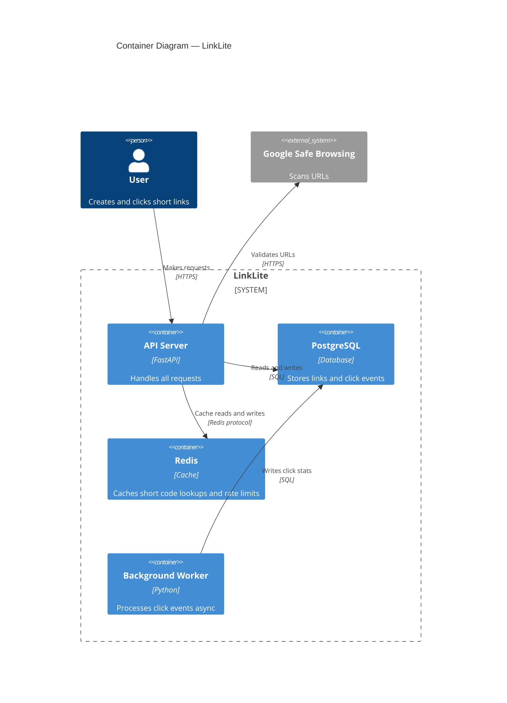
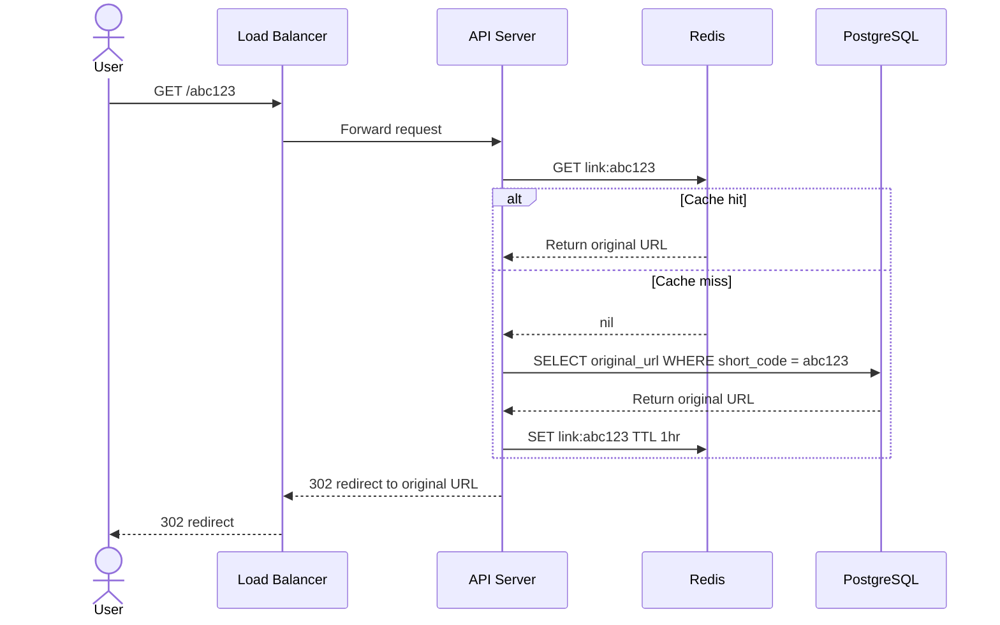

# LinkLite Diagrams

## 1. Context Diagram

```mermaid

  title System Context — LinkLite

  Person(user, "User", "Creates short links and shares them")

  System(linklite, "LinkLite", "URL shortening service")

  System_Ext(safebrowsing, "Google Safe Browsing", "Scans URLs for malicious content")

  Rel(user, linklite, "Creates and clicks short links")
  Rel(linklite, safebrowsing, "Validates URLs before storing")
```

## 2. Container Diagram



## 3. Sequence Diagram — Redirect Flow


