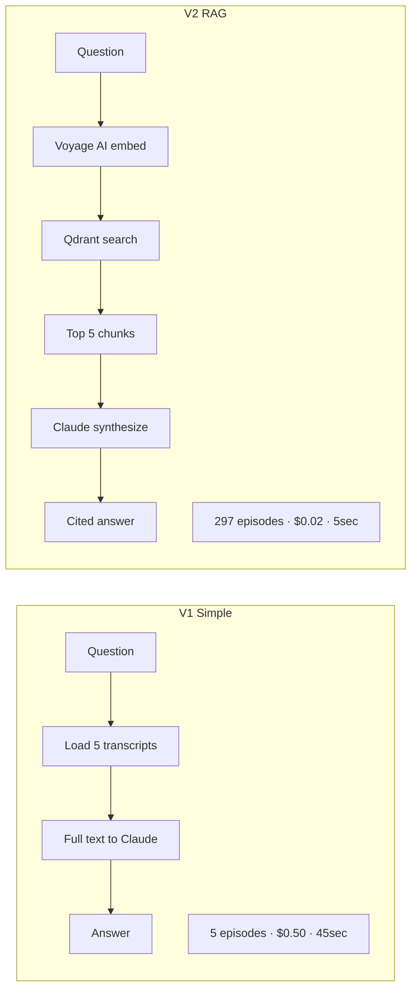
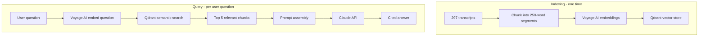

# LennyHub RAG — AI Systems Design Case Study

---

## What it is
A RAG-powered Q&A system over 297 episodes of Lenny's Podcast.
Ask any question about product management, growth, and startups —
get a cited answer synthesized from actual episode transcripts.

**Problem it solves:** Lenny's Podcast has 297+ episodes of dense
product and growth knowledge. Finding a specific insight requires
manually searching through hundreds of hours of content. LennyHub
lets you ask "what does Lenny say about pricing strategy?" and get
a synthesized answer with episode citations in seconds.

---

## 1. Functional Requirements

1. Ask natural language questions about Lenny's Podcast content
2. Return synthesized answers grounded in actual transcript text
3. Cite specific episodes that support the answer
4. Search semantically — not just keyword matching
5. Handle questions the transcripts don't cover gracefully

**Users:** Product managers, founders, growth practitioners who
want Lenny's knowledge base as a queryable resource.

---

## 2. Non-Functional Requirements

| Requirement | Target |
|---|---|
| Answer latency | Under 10 seconds per query |
| Citation accuracy | Every claim traced to a specific episode |
| Semantic accuracy | Finds relevant content even with different wording |
| Scale | 297 transcripts (~1.5M tokens of content) |
| Privacy | No user data stored — session only |

---

## 3. Back-of-the-Envelope Calculations

| Metric | Estimate |
|---|---|
| Total transcripts | 297 episodes |
| Average transcript length | ~5,000 words |
| Total words indexed | ~1.5 million |
| Average chunks per transcript | ~20 chunks |
| Total chunks in Qdrant | ~5,940 chunks |
| Embedding dimensions (Voyage AI) | 1,024 |
| Qdrant storage for vectors | ~24MB |
| Average query response time | 3-8 seconds |

**Key insight:** 1.5M words far exceeds any LLM context window.
RAG is not optional here — it's the only viable architecture.
Sending all 297 transcripts to Claude would cost ~$50 per query
and take minutes. RAG reduces this to cents and seconds.

---

## 4. Architecture — What Happens Under the Hood

### V1 — Simple version (current in main.py)
```
User asks question
    ↓
Load 5 transcripts directly into context
    ↓
Send full transcripts + question to Claude
    ↓
Claude synthesizes answer
```
**Problem:** Only works for 5 transcripts. Breaks at scale.
Cost: ~$0.50 per query at 5 transcripts.

### V2 — Full RAG version (current in app.py)
```
INDEXING (one-time setup):
297 transcripts
    ↓
Split into chunks (~250 words each)
    ↓
Voyage AI creates embedding vector per chunk
    ↓
Vectors stored in Qdrant with metadata:
  - episode number
  - episode title
  - chunk text
  - timestamp range

QUERYING (per user question):
User asks: "What does Lenny say about pricing?"
    ↓
Voyage AI embeds the question → query vector
    ↓
Qdrant semantic search → top 5 most similar chunks
    ↓
Prompt assembled:
  "Answer this question using only these transcript excerpts:
   {top_5_chunks}
   Question: {user_question}
   Cite specific episodes for every claim."
    ↓
Claude synthesizes answer with citations
    ↓
Answer displayed with episode references
```

---

## 5. Trade-offs

### Trade-off 1: RAG vs full context

| | Full context (V1) | RAG with Qdrant (V2) |
|---|---|---|
| Transcripts covered | 5 max | All 297 |
| Cost per query | ~$0.50 | ~$0.02 |
| Latency | 30-60 seconds | 3-8 seconds |
| Setup complexity | None | Indexing pipeline needed |
| Citation accuracy | High — sees full text | Good — depends on chunk quality |
| **Choose when** | Prototype, few docs | Production, large corpus |

**Decision:** RAG for V2 — 297 transcripts make full context impossible.

### Trade-off 2: Voyage AI embeddings vs OpenAI embeddings

| | OpenAI embeddings | Voyage AI embeddings |
|---|---|---|
| Quality | Good | Better for long-form text |
| Cost | $0.0001/1K tokens | Comparable |
| Dimensions | 1,536 | 1,024 |
| Domain tuning | General | Better for documents/books |
| **Choose when** | General use | Document-heavy RAG |

**Decision:** Voyage AI — better semantic search on long podcast transcripts.

### Trade-off 3: Qdrant local vs Qdrant Cloud

| | Local Docker | Qdrant Cloud |
|---|---|---|
| Cost | Free | Free tier available |
| Persistence | Lost on container restart | Persistent |
| Setup | Docker required | API key only |
| Production ready | No | Yes |
| **Choose when** | Development | Production deployment |

**Decision:** Local for development. Cloud needed for public deployment.

### Trade-off 4: Chunk size

| | Small chunks (100 words) | Medium chunks (250 words) | Large chunks (500 words) |
|---|---|---|---|
| Precision | High — very specific | Good balance | Low — too much noise |
| Context | Low — loses surrounding context | Good | High — more context per chunk |
| Vector count | Many — more storage | Moderate | Few — less storage |
| **Choose when** | Fact retrieval | Mixed content | Long-form reasoning |

**Decision:** ~250 words — podcast transcripts have long reasoning chains
that need surrounding context to make sense.

---

## 6. Data Modeling

### Qdrant collection: `lenny_transcripts`

Each point in Qdrant represents one chunk:

```python
{
  "id": "uuid",
  "vector": [1024 floats],  # Voyage AI embedding
  "payload": {
    "episode_number": 245,
    "episode_title": "How Notion grew to $10B",
    "chunk_text": "The key insight about pricing...",
    "chunk_index": 12,
    "word_count": 247
  }
}
```

### No relational database needed
All data lives in Qdrant. Transcript text stored as payload alongside
vectors — no separate DB required. Simple, fast, single source of truth.

---

## 7. Deep Dives

### Deep dive 1: How semantic search works

**Why keyword search fails for this use case:**

User asks: "How do you build a pricing strategy?"

Relevant transcript says: "When thinking about monetization,
the first question is always who pays and why..."

Keyword search: no match — "pricing" not in the text.
Semantic search: high similarity — same concept, different words.

**How Qdrant finds the right chunks:**

```
Question → Voyage AI → query vector [0.2, -0.5, 0.8, ...]
    ↓
Qdrant computes cosine similarity between query vector
and all 5,940 chunk vectors
    ↓
Returns top 5 chunks with highest similarity score
    ↓
These chunks are semantically closest to the question
```

Cosine similarity measures angle between vectors. Vectors for
"pricing strategy" and "monetization approach" point in similar
directions — high similarity. Vectors for "pricing strategy"
and "team culture" point in very different directions — low similarity.

### Deep dive 2: The chunking decision

**Why chunking matters:**

A 1-hour podcast transcript is ~8,000 words. You can't embed the
whole thing as one vector — you lose specificity. The embedding
becomes an average of all topics discussed in the episode.

Breaking into 250-word chunks means each vector represents
one specific idea. Search finds the exact relevant passage,
not "this episode might be relevant."

**The overlap problem:**
If you split strictly at 250 words, a sentence might be split
in half. LennyHub uses sentence-boundary chunking — never split
mid-sentence. Also overlaps adjacent chunks by 50 words so
context isn't lost at boundaries.

### Deep dive 3: Citation grounding

**How hallucinations are prevented:**

The prompt explicitly instructs Claude:
```
"Answer ONLY using information from these transcript excerpts.
 If the excerpts don't contain enough information, say so.
 For every claim, cite the episode number and title."
```

Claude cannot make up information because it's told to only
use the provided chunks. If the answer isn't in the top 5
retrieved chunks — Claude says it doesn't know. This is
the core value of RAG over a standalone LLM.

### Deep dive 4: V1 vs V2 comparison



---

## 8. Final Design and Recap



**Key decisions recap:**
- RAG not full context → 297 transcripts, not 5
- Voyage AI embeddings → better on long-form text than OpenAI
- Qdrant → fast vector search, simple local setup
- 250-word chunks → specific enough for precision, large enough for context
- Citation-grounded prompting → no hallucinations

---

## 9. Breadth — Monitoring, Testing, Deployments, Cost, Security

### Monitoring
- Answer quality — manual spot checks on citation accuracy
- Qdrant query latency — semantic search under 500ms
- Claude response time — synthesis under 5 seconds
- Retrieval relevance — are top 5 chunks actually relevant?

### Testing
- Eval set — 20 known questions with verified correct answers
- Citation accuracy — does every claim have a valid episode reference?
- Edge cases — questions outside the corpus return "I don't know"
- Chunk quality — spot check random chunks for coherent boundaries

### Deployments
- Local: Docker (Qdrant) + Streamlit + Python
- Production: Qdrant Cloud + Streamlit Cloud
- Indexing pipeline runs once — re-run only for new episodes

### Cost
| Component | Cost |
|---|---|
| Voyage AI embeddings (one-time indexing) | ~$0.50 for 297 transcripts |
| Qdrant local | Free |
| Qdrant Cloud | Free tier (1M vectors) |
| Claude per query | ~$0.02 (5 chunks × ~500 tokens) |
| Streamlit Cloud | Free |

**Total cost per query: ~$0.02** vs $0.50 for V1 full context approach.
25x cheaper. 9x faster. Covers all 297 episodes instead of 5.

### Security
- API keys in .env — never committed to GitHub
- No user data stored — session only
- Transcript content is public podcast data — no privacy concern
- No authentication needed — read-only knowledge base

---

## Portfolio Talking Points
- Built a production RAG system over 297 podcast transcripts
- Designed and compared V1 (naive) vs V2 (vector search) architectures
- 25x cost reduction and 9x latency improvement from V1 to V2
- Chose Voyage AI over OpenAI embeddings — justified by domain fit
- Chunking strategy designed for podcast transcript characteristics
- Citation-grounded prompting prevents hallucinations architecturally
- Understands the full RAG stack: chunking → embedding → vector search → synthesis