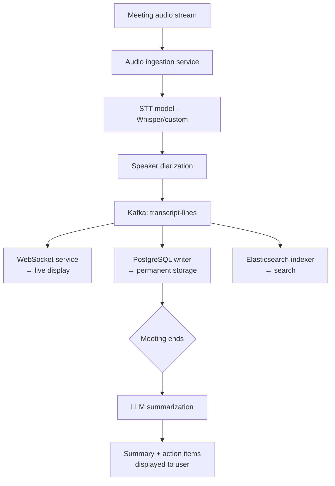
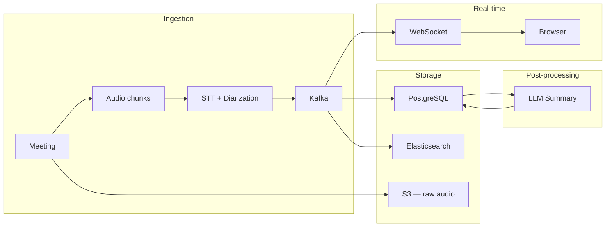
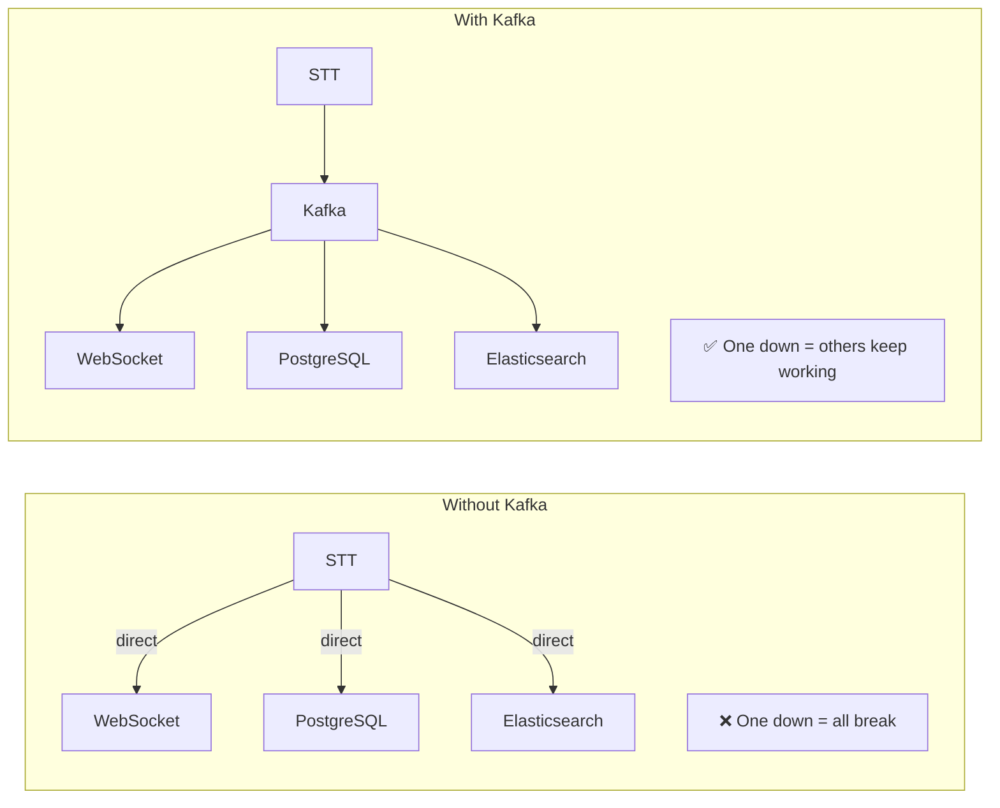

# Otter.ai — System Design Case Study

## 1. Functional Requirements

- Record live meeting audio in real time
- Transcribe audio to text with speaker identification (diarization)
- Display transcript live in browser as meeting happens
- Generate summary and action items after meeting ends
- Search across all past meeting transcripts

**Users:** Employees, students, journalists — anyone who needs accurate meeting records.

---

## 2. Non-Functional Requirements

| Requirement           | Target                                                 |
| --------------------- | ------------------------------------------------------ |
| Transcription latency | Transcript appears within 2 seconds of speech          |
| Scalability           | 100,000 simultaneous meetings                          |
| Availability          | 99.99% uptime                                          |
| Privacy               | Audio and transcripts encrypted at rest and in transit |
| Search latency        | Results returned in under 500ms                        |

---

## 3. Back-of-the-Envelope Calculations

| Metric                       | Estimate                   |
| ---------------------------- | -------------------------- |
| Daily active meetings        | 500,000                    |
| Peak simultaneous meetings   | 100,000                    |
| Average meeting duration     | 45 minutes                 |
| Audio data per meeting       | ~50MB                      |
| Daily audio storage          | 500,000 × 50MB = 25TB      |
| Transcript lines per meeting | ~500 lines                 |
| Daily transcript lines       | 250 million                |
| Transcript storage per line  | ~200 bytes                 |
| Daily transcript storage     | ~50GB                      |
| Kafka messages per second    | 250M ÷ 86,400 = ~2,900/sec |

**Key insight:** Audio is the storage problem (25TB/day). Transcripts are the compute problem (2,900 Kafka messages/sec).

---

## 4. High-Level Design Overview



**The pipeline:**

```
Audio stream
    ↓
Audio ingestion (capture + chunk every 2 seconds)
    ↓
STT model (audio → text)
    ↓
Speaker diarization (who said what)
    ↓
Kafka topic: transcript-lines
    ↓
3 consumer groups read simultaneously:
    1. WebSocket → live transcript in browser
    2. PostgreSQL → permanent storage
    3. Elasticsearch → search index
    ↓ (after meeting ends)
LLM → summary + action items
```

---

## 5. Trade-offs

### Trade-off 1: Third-party STT vs self-hosted

|                 | Third-party API (Google/AssemblyAI) | Self-hosted (Whisper)                |
| --------------- | ----------------------------------- | ------------------------------------ |
| Cost at scale   | $27,000/day at 4.5M min/day         | Pay for GPU servers only             |
| Accuracy        | Good                                | Customizable for domain              |
| Privacy         | Audio leaves your servers           | Audio stays internal                 |
| Ops complexity  | None                                | High                                 |
| **Choose when** | Under 10k min/day                   | Over 10k min/day or privacy required |

**Decision:** Self-hosted Whisper on GPU clusters at Otter's scale.

### Trade-off 2: Kafka vs direct service calls

|                 | Direct calls                        | Kafka                            |
| --------------- | ----------------------------------- | -------------------------------- |
| Complexity      | Low                                 | High                             |
| Coupling        | Tight — one service down breaks all | Loose — services independent     |
| Replay          | Not possible                        | Yes — replay from any offset     |
| At scale        | Breaks under load                   | Handles millions of messages/sec |
| **Choose when** | Low scale, simple pipeline          | High scale, multiple consumers   |

**Decision:** Kafka — 3 consumer groups need to read the same transcript independently.

### Trade-off 3: WebSocket vs polling for live transcript

|                 | HTTP Polling                             | WebSocket                       |
| --------------- | ---------------------------------------- | ------------------------------- |
| Latency         | Up to 1 second delay                     | Milliseconds                    |
| Battery impact  | High — constant requests                 | Low — one persistent connection |
| Server load     | High — 100k users polling = 100k req/sec | Low — push only when new text   |
| **Choose when** | Simple, infrequent updates               | Real-time, continuous updates   |

**Decision:** WebSocket — transcript must feel live, not delayed.

---

## 6. Data Modeling

### meetings

| Column           | Type      | Notes                          |
| ---------------- | --------- | ------------------------------ |
| id               | UUID      | primary key                    |
| user_id          | UUID      | who owns the meeting           |
| title            | VARCHAR   | meeting name                   |
| status           | VARCHAR   | recording/processing/completed |
| duration_seconds | INTEGER   | meeting length                 |
| created_at       | TIMESTAMP | when meeting started           |

### transcript_lines

| Column          | Type      | Notes                  |
| --------------- | --------- | ---------------------- |
| id              | UUID      | primary key            |
| meeting_id      | UUID      | foreign key → meetings |
| speaker_id      | UUID      | who said it            |
| content         | TEXT      | what was said          |
| timestamp       | TIMESTAMP | when it was said       |
| sequence_number | INTEGER   | order of lines         |

### summaries

| Column       | Type      | Notes                  |
| ------------ | --------- | ---------------------- |
| id           | UUID      | primary key            |
| meeting_id   | UUID      | foreign key → meetings |
| summary_text | TEXT      | LLM generated          |
| action_items | TEXT      | extracted items        |
| created_at   | TIMESTAMP | when generated         |

### users

| Column     | Type      | Notes           |
| ---------- | --------- | --------------- |
| id         | UUID      | primary key     |
| email      | VARCHAR   | unique          |
| name       | VARCHAR   | display name    |
| created_at | TIMESTAMP | account created |

### meeting_participants

| Column     | Type    | Notes                  |
| ---------- | ------- | ---------------------- |
| meeting_id | UUID    | foreign key → meetings |
| user_id    | UUID    | foreign key → users    |
| role       | VARCHAR | host/participant       |

---

## 7. Deep Dives

### Deep dive 1: Speaker Diarization

**The hardest problem in the system.**

Separating overlapping voices and attributing each transcript line to the correct speaker in real time.

**How it works:**

1. Audio stream split into 2-second chunks
2. Each chunk analyzed for voice characteristics (pitch, tone, frequency)
3. Speakers assigned labels (Speaker 1, Speaker 2...)
4. If user has spoken before — matched to known voice profile
5. Labels updated as new speakers join

**Failure modes:**

- Two people talk at the same time → line attributed to wrong speaker
- Background noise → ghost speaker created
- Accents → STT accuracy drops

**Mitigation:** Post-processing pass after meeting to clean up diarization errors. User can manually correct speaker labels.

### Deep dive 2: Real-time transcript delivery

**How text appears in browser within 2 seconds of speech.**

```
STT produces text chunk
    ↓
Kafka message published (< 10ms)
    ↓
WebSocket consumer reads message
    ↓
Pushes to user's open WebSocket connection
    ↓
Browser renders new transcript line
Total: < 500ms from speech to screen
```

**WebSocket connection management at 100k meetings:**

- 100k simultaneous meetings × avg 5 participants = 500k open WebSocket connections
- Each connection assigned to a WebSocket server
- Consistent hashing routes user to their assigned server
- If server crashes → client auto-reconnects, missed lines replayed from Kafka

### Deep dive 3: LLM Summarization

**How summary is generated after meeting ends.**

```
Meeting ends
    ↓
All transcript lines fetched from PostgreSQL
    ↓
Prompt assembled:
  "Here is the meeting transcript: {transcript}
   Generate: 1) Summary 2) Action items 3) Key decisions"
    ↓
LLM called (Claude/GPT-4)
    ↓
Structured response parsed
    ↓
Summary stored + displayed
```

**Problem:** Long meetings (2 hours) = 1000+ transcript lines = exceeds LLM context window.

**Solution:** Chunked summarization

1. Split transcript into 10-minute chunks
2. Summarize each chunk independently
3. Summarize the summaries into final output

### Deep dive 4: Search

**How users find specific moments across all past meetings.**

- Elasticsearch indexes every transcript line after meeting ends
- Search query matches against content, speaker, meeting title
- Results ranked by relevance + recency
- Click result → jump to that moment in the transcript

**Why Elasticsearch not PostgreSQL:**
PostgreSQL `LIKE '%running shoes%'` scans every row.
Elasticsearch uses inverted index — finds "running shoes" in milliseconds across 250M lines.

---

## 8. Final Design and Recap



**Key decisions recap:**

- Self-hosted STT → privacy + cost at scale
- Kafka → decouples 3 consumers, enables replay
- WebSocket → real-time transcript delivery
- Chunked summarization → handles long meetings
- Elasticsearch → fast search across 250M lines

---

## 9. Breadth — Monitoring, Testing, Deployments, Cost, Security

### Monitoring

- STT accuracy rate — % of words correctly transcribed
- Transcript latency — speech to screen in milliseconds
- Kafka consumer lag — are consumers keeping up?
- WebSocket connection count — active meetings
- LLM summarization failure rate

### Testing

- Unit tests on chunking and diarization logic
- Integration tests on full pipeline end to end
- Load tests simulating 100k simultaneous meetings
- Accuracy benchmarks — compare STT output to human transcription

### Deployments

- STT service on GPU auto-scaling cluster
- Kafka with replication factor 3 — no data loss
- WebSocket servers behind load balancer
- Blue-green deployment — no downtime on updates

### Cost

| Component          | Cost driver                                    |
| ------------------ | ---------------------------------------------- |
| STT (GPU)          | Most expensive — runs continuously per meeting |
| Audio storage (S3) | 25TB/day — significant but manageable          |
| Kafka              | Moderate — scales with message volume          |
| LLM summarization  | Per-meeting cost — optimize with chunking      |
| Elasticsearch      | Storage + compute for indexing                 |

### Security

- Audio encrypted in transit (TLS) and at rest (AES-256)
- Transcripts never used to train models without consent
- Meeting data isolated per organization
- GDPR compliant — right to delete all meeting data

---

## 10. Diagrams

### Kafka decoupling


