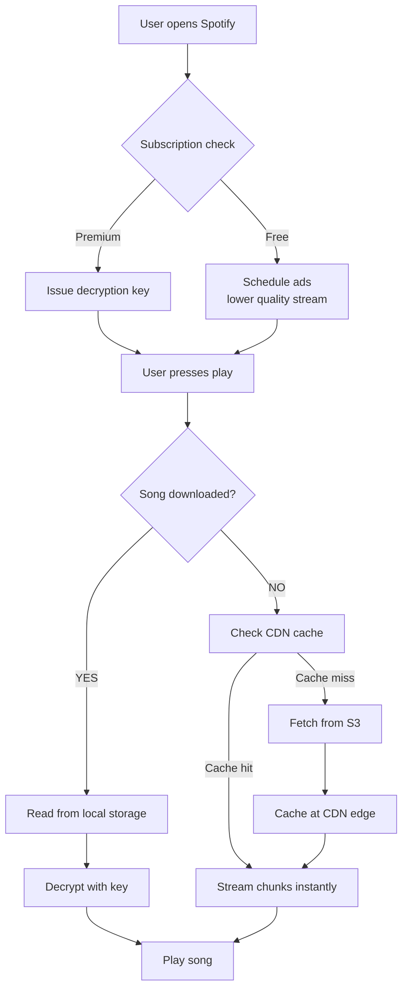
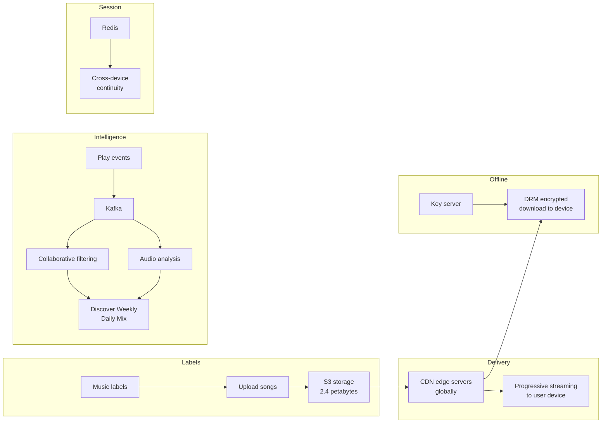

# Spotify — System Design Case Study

---

## 1. Functional Requirements

1. Stream music — play any song instantly on any device
2. Search — find songs, artists, albums, podcasts
3. Download for offline — save songs to device, play without internet
4. Create and share playlists — personal and collaborative
5. Recommendations — Discover Weekly, Daily Mix, autoplay next song

**Free vs Premium:**
- Free → ads injected into stream, shuffle only, can't skip freely
- Premium → on-demand play, downloads, no ads, higher quality audio

**Users:** 600M total, 200M premium, across mobile, desktop, smart speakers, cars.

---

## 2. Non-Functional Requirements

| Requirement | Target |
|---|---|
| Stream start latency | Under 200ms from press play |
| Availability | 99.99% uptime |
| Scalability | 100M simultaneous streams at peak |
| Storage | 100M+ songs in multiple quality formats |
| Offline reliability | Downloaded songs playable without any network |

---

## 3. Back-of-the-Envelope Calculations

| Metric | Estimate |
|---|---|
| Total users | 600M |
| Premium users | 200M |
| Songs in catalog | 100M+ |
| Average song size (320kbps) | ~8MB |
| Quality formats stored | 3 (320kbps, 128kbps, 96kbps) |
| Total music storage | 100M × 8MB × 3 = **2.4 petabytes** |
| Peak simultaneous streams | 100M |
| Audio data per stream | ~32KB/sec |
| Peak bandwidth | 100M × 32KB = **3.2 TB/sec** |

**Key insight:** 3.2TB/sec of audio flowing continuously at peak.
CDN is not optional — it's survival. Without edge caching, origin
servers would collapse under this load instantly.

---

## 4. High-Level Design Overview



**Progressive streaming:**
```
Song split into small chunks (few seconds each)
    ↓
First 2-3 chunks downloaded → playback starts (<200ms)
    ↓
Rest downloads in background while listening
    ↓
Network drops → buffer plays while reconnecting
    ↓
Seek to minute 2 → fetch from that chunk directly
```

---

## 5. Trade-offs

### Trade-off 1: Progressive streaming vs full download before play

| | Full download first | Progressive streaming |
|---|---|---|
| Start latency | 2-3 seconds | Under 200ms |
| Bandwidth efficiency | Wastes data if user skips | Only downloads what's listened to |
| Seek support | Simple | Requires chunk indexing |
| **Choose when** | Never for music | Always |

**Decision:** Progressive streaming — 200ms start time is non-negotiable.

### Trade-off 2: DRM encrypted downloads vs plain files

| | Plain MP3 files | DRM encrypted |
|---|---|---|
| User experience | Can use anywhere | Locked to Spotify app |
| Label requirements | Labels won't allow | Required by all major labels |
| Subscription enforcement | Impossible | Server controls decryption keys |
| **Choose when** | Never — labels won't permit | Always for licensed content |

**Decision:** DRM — not a choice. Music labels require it. Without DRM,
Spotify can't license content from any major label.

### Trade-off 3: Push recommendations vs pull

| | Pull (user requests) | Push (pre-computed) |
|---|---|---|
| Freshness | Always current | May be slightly stale |
| Latency | Slow — computed on request | Fast — already computed |
| Discover Weekly timing | Can't pre-compute weekly | Pre-computed every Monday |
| **Choose when** | Real-time personalization | Weekly/daily playlists |

**Decision:** Hybrid — Discover Weekly pre-computed weekly,
autoplay computed in real-time as you listen.

### Trade-off 4: CDN strategy for long-tail vs popular songs

| | Cache everything | Cache popular only |
|---|---|---|
| Storage cost | Enormous | Manageable |
| Cache hit rate | Near 100% | ~80% (top 20% of songs = 80% of streams) |
| Obscure song performance | Instant | Fetched from S3 on miss |
| **Choose when** | Impossible at 2.4PB | What Spotify actually does |

**Decision:** Cache top 20% of songs at CDN edge — covers 80% of
all streams. Long-tail songs served from S3 on demand.

---

## 6. Data Modeling

### songs
| Column | Type | Notes |
|---|---|---|
| id | UUID | unique song ID |
| title | VARCHAR | song name |
| artist_id | UUID | foreign key → artists |
| album_id | UUID | foreign key → albums |
| duration_seconds | INTEGER | song length |
| s3_url_320kbps | TEXT | premium quality |
| s3_url_128kbps | TEXT | free quality |
| s3_url_96kbps | TEXT | low data quality |
| release_date | DATE | when released |

### user_library
| Column | Type | Notes |
|---|---|---|
| user_id | UUID | foreign key → users |
| song_id | UUID | foreign key → songs |
| saved_at | TIMESTAMP | when saved |
| downloaded | BOOLEAN | saved for offline |

### play_events
| Column | Type | Notes |
|---|---|---|
| id | UUID | event ID |
| user_id | UUID | who listened |
| song_id | UUID | what they played |
| listen_seconds | INTEGER | how long |
| completion_rate | FLOAT | % of song heard |
| skipped | BOOLEAN | did they skip |
| event_type | VARCHAR | play/pause/skip/save |
| created_at | TIMESTAMP | when |

### playlists
| Column | Type | Notes |
|---|---|---|
| id | UUID | playlist ID |
| owner_id | UUID | who created it |
| name | VARCHAR | playlist name |
| is_collaborative | BOOLEAN | shared editing |
| is_public | BOOLEAN | visible to others |
| created_at | TIMESTAMP | when created |

### subscriptions
| Column | Type | Notes |
|---|---|---|
| user_id | UUID | foreign key → users |
| tier | VARCHAR | free/premium/family/student |
| status | VARCHAR | active/cancelled/expired |
| expires_at | TIMESTAMP | when subscription ends |
| drm_key | TEXT | decryption key for downloads |

---

## 7. Deep Dives

### Deep dive 1: DRM and offline playback
**How Spotify controls downloaded songs.**

```
User downloads song (Premium only)
    ↓
Encrypted file stored on device
    ↓
App checks server on every open:
  "Is user_123 subscription still active?"
    ↓
Active → server sends decryption key → song plays
Cancelled → no key → encrypted file unplayable
    ↓
Key check also happens every 30 days
even if user doesn't open the app
```

**Why server controls the key:**
Spotify doesn't trust the app to enforce rules.
Even a hacked app can't play songs without the server-issued key.
Labels require this — it's non-negotiable for licensing.

### Deep dive 2: Recommendation engine
**How Discover Weekly and Daily Mix work.**

**Two approaches combined:**

1. **Collaborative filtering**
"Users who listen to what you listen to also like X"
Find users with similar taste → recommend what they love that you haven't heard

2. **Audio analysis**
Every song analyzed for: tempo, key, energy, danceability, acousticness
Songs with similar audio fingerprints recommended together

**Discover Weekly — pre-computed every Monday:**
```
Your listening history (last 4 weeks)
    ↓
Collaborative filtering → 1000 candidate songs
    ↓
Filter out songs you've heard before
    ↓
Audio analysis matching → rank by similarity
    ↓
30 songs selected → stored as your Discover Weekly playlist
    ↓
Monday morning → playlist updated
```

**Why Monday:** Spotify batch-processes all 600M users' Discover
Weekly playlists over the weekend. Too expensive to do in real-time.

### Deep dive 3: Cross-device continuity
**How you start on phone and continue on laptop.**

```
Playing on phone → session stored in Redis:
  {user_id: "123", song_id: "abc", position_seconds: 47}
    ↓
Open Spotify on laptop
    ↓
Laptop fetches session from Redis
    ↓
Resumes from second 47 of the same song
    ↓
Phone session invalidated
```

**Why Redis not PostgreSQL:**
Session needs to be read in milliseconds across any device globally.
Redis is in-memory — sub-millisecond reads. PostgreSQL would be too slow.

### Deep dive 4: Ad injection for free users
**How ads are inserted into the stream.**

```
Free user plays songs
    ↓
After every 3-4 songs → ad slot triggered
    ↓
Ad server selects targeted ad:
  - User location
  - Listening history
  - Time of day
  - Device type
    ↓
Ad audio file fetched from ad CDN
    ↓
Injected into audio stream
    ↓
Song resumes after ad completes
    ↓
User cannot skip (free tier)
```

**Revenue model:**
Free users → ads → ~$1-2 per user per month revenue
Premium users → $10.99/month subscription
200M premium × $10.99 = ~$2.2B/month

---

## 8. Final Design and Recap



**Key decisions recap:**
- Progressive streaming → 200ms start time
- DRM encryption → label requirement, server controls keys
- CDN caches top 20% of songs → covers 80% of streams
- Redis for session → cross-device continuity in milliseconds
- Collaborative filtering + audio analysis → Discover Weekly
- Pre-computed weekly recommendations → too expensive real-time
- Ad injection after every 3-4 songs → free tier monetization

---

## 9. Breadth — Monitoring, Testing, Deployments, Cost, Security

### Monitoring
- Stream start latency — p50, p95, p99
- Buffer rate — % of streams that pause to buffer
- CDN cache hit rate — % served from edge vs S3
- DRM key validation success rate
- Ad delivery rate — % of ad slots successfully filled
- Recommendation CTR — % of Discover Weekly songs actually played

### Testing
- Load tests — 100M simultaneous streams sustained
- DRM validation — cancellation immediately stops playback
- Cross-device sync — session handoff under 500ms
- Offline playback — all downloaded songs play without network
- Ad injection timing — ads fire correctly every 3-4 songs

### Deployments
- Recommendation models retrained weekly (Discover Weekly)
- CDN config updates rolled out gradually
- App updates — phased rollout 1% → 10% → 100% of users
- DRM key rotation — periodic security requirement

### Cost
| Component | Cost driver |
|---|---|
| S3 storage | 2.4PB music catalog — one-time + new releases |
| CDN | 3.2TB/sec peak bandwidth — largest ongoing cost |
| Recommendation compute | Weekly batch processing for 600M users |
| DRM key server | Always-on, high availability required |
| Redis | Session data for 600M users globally |

### Security
- DRM — all downloads encrypted, server controls keys
- HTTPS — all streams encrypted in transit
- License enforcement — subscription verified server-side
- Piracy prevention — audio fingerprinting detects leaked content
- GDPR — listening history deletable on request

