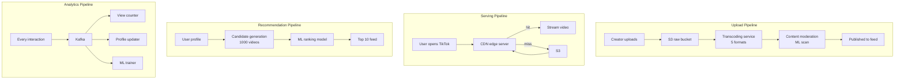
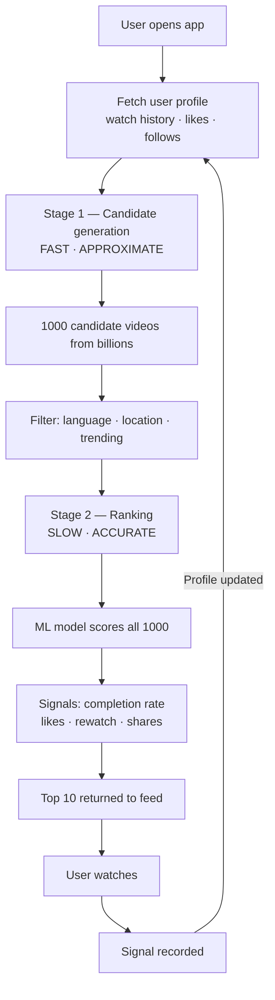
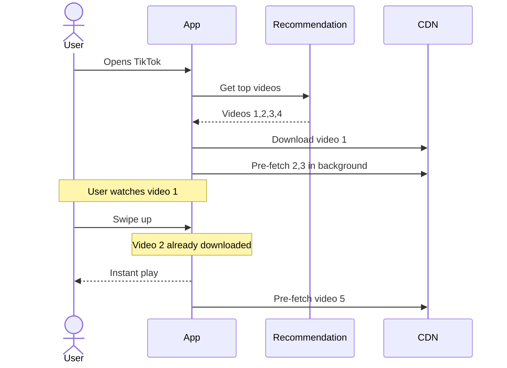
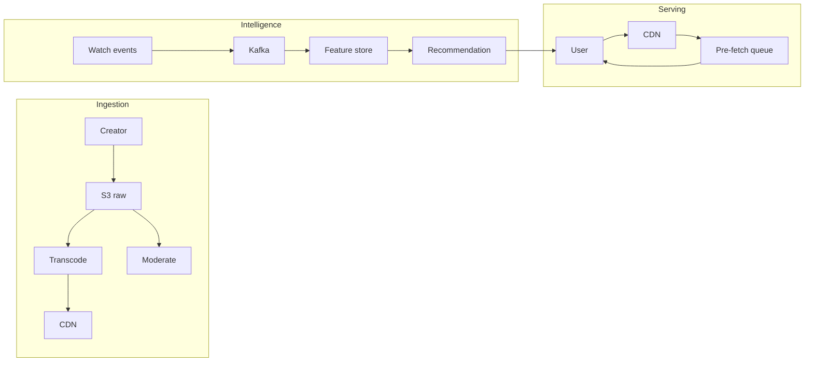

# TikTok — System Design Case Study

---

## 1. Functional Requirements

- Upload short-form videos (15 seconds to 10 minutes)
- Watch personalized video feed — autoplay, infinite scroll
- Interact with videos — like, comment, share, follow creator
- Search videos by keyword, hashtag, sound
- Content moderation — detect and remove violating content

**Users:** 1 billion daily active users globally across mobile devices.

---

## 2. Non-Functional Requirements

| Requirement          | Target                                       |
| -------------------- | -------------------------------------------- |
| Video start latency  | Under 2 seconds on any network               |
| Feed personalization | Feed feels personal within 3-5 videos        |
| Scalability          | 10 million video uploads per day             |
| Availability         | 99.99% uptime                                |
| Content moderation   | Violating content removed before going viral |

---

## 3. Back-of-the-Envelope Calculations

| Metric                              | Estimate                   |
| ----------------------------------- | -------------------------- |
| Daily active users                  | 1 billion                  |
| Videos uploaded per day             | 10 million                 |
| Average raw video size              | 50MB                       |
| Daily raw upload storage            | 10M × 50MB = 500TB         |
| Transcoding formats                 | 5 per video                |
| Daily storage after transcoding     | 500TB × 5 = 2.5PB          |
| Video views per day                 | 1 billion+                 |
| Recommendation decisions per second | 1B ÷ 86,400 = ~11,600/sec  |
| Kafka events per second             | ~50,000/sec (interactions) |

**Key insight:** 2.5PB new storage per day. Recommendation engine running 11,600 ML inferences per second. Both are massive engineering problems.

---

## 4. High-Level Design Overview



---

## 5. Trade-offs

### Trade-off 1: Pre-fetching vs on-demand loading

|                  | On-demand               | Pre-fetching                    |
| ---------------- | ----------------------- | ------------------------------- |
| Video start time | 1-3 seconds             | Instant                         |
| Data usage       | Only what user watches  | Downloads unwatched videos      |
| Battery impact   | Lower                   | Higher                          |
| User experience  | Loading spinner visible | Seamless scroll                 |
| **Choose when**  | Low-engagement content  | High-engagement infinite scroll |

**Decision:** Pre-fetch next 2-3 videos while user watches current one. TikTok trades data usage for instant playback — core to the product experience.

### Trade-off 2: Push vs pull feed generation

|                   | Push (fan-out on write)                 | Pull (fan-out on read)           |
| ----------------- | --------------------------------------- | -------------------------------- |
| How               | Pre-compute feed when video uploaded    | Compute feed when user opens app |
| Latency           | Fast reads — feed pre-built             | Slow reads — computed on demand  |
| Storage           | High — store feed per user              | Low — no pre-computed feeds      |
| Celebrity problem | 100M followers × 1 upload = 100M writes | No write amplification           |
| **Choose when**   | Regular users                           | Celebrity creators               |

**Decision:** Hybrid — push for regular users, pull for celebrities (100M+ followers).

### Trade-off 3: Two-stage recommendation vs single model

|                 | Single ranking model         | Two-stage (candidate + ranking)         |
| --------------- | ---------------------------- | --------------------------------------- |
| Accuracy        | High                         | Slightly lower                          |
| Latency         | Slow — runs on all 3B videos | Fast — cheap filter then expensive rank |
| Cost            | Extremely high               | Manageable                              |
| **Choose when** | Small catalog                | Billion-scale catalog                   |

**Decision:** Two-stage — can't run expensive ML model on 3 billion videos per request.

---

## 6. Data Modeling

### videos

| Column           | Type      | Notes                        |
| ---------------- | --------- | ---------------------------- |
| id               | UUID      | unique video ID              |
| creator_id       | UUID      | who uploaded                 |
| title            | TEXT      | video title                  |
| s3_url_1080p     | TEXT      | high quality                 |
| s3_url_480p      | TEXT      | medium quality               |
| s3_url_240p      | TEXT      | low quality                  |
| duration_seconds | INTEGER   | video length                 |
| status           | VARCHAR   | processing/published/removed |
| created_at       | TIMESTAMP | upload time                  |

### video_events

| Column          | Type      | Notes                    |
| --------------- | --------- | ------------------------ |
| id              | UUID      | event ID                 |
| user_id         | UUID      | who watched              |
| video_id        | UUID      | what they watched        |
| watch_seconds   | INTEGER   | how long                 |
| completion_rate | FLOAT     | percentage watched       |
| event_type      | VARCHAR   | watch/like/share/comment |
| created_at      | TIMESTAMP | when                     |

### user_profiles

| Column          | Type      | Notes                       |
| --------------- | --------- | --------------------------- |
| user_id         | UUID      | primary key                 |
| interest_vector | BLOB      | ML embedding of preferences |
| watch_history   | JSON      | last 1000 videos            |
| updated_at      | TIMESTAMP | last update                 |

---

## 7. Deep Dives

### Deep dive 1: The recommendation engine

**TikTok's core competitive advantage.**



**Why TikTok learns faster than YouTube:**

- TikTok videos 15-60 sec → hundreds of signals per hour
- YouTube videos 10-20 min → 5-10 signals per hour
- More signals = faster learning = better recommendations

**The key signal — completion rate:**
| Action | Signal strength |
|---|---|
| Watched 100% | Strong positive |
| Rewatched | Very strong positive |
| Scrolled after 2 seconds | Strong negative |
| Liked/commented | Positive but weaker |

### Deep dive 2: Pre-fetching pipeline



### Deep dive 3: Content moderation

**Must catch violating content before it goes viral.**

```
Video uploaded
    ↓
ML model scans: nudity · violence · hate speech · spam
    ↓
Confidence score returned
    ↓
High confidence violation → auto-removed
Low confidence → human review queue
Borderline → published with reduced distribution
```

**Why speed matters:** A violating video can reach 1M views in minutes on TikTok. Moderation must happen before or immediately after publishing.

### Deep dive 4: Cold start problem

**New user — no watch history — what to show?**

1. Show globally trending videos
2. Onboarding — ask for 3 interest categories
3. After 5 videos — enough signal to personalize
4. After 20 videos — feed feels fully personal

---

## 8. Final Design and Recap



**Key decisions recap:**

- Pre-fetching → instant playback, core to engagement
- Hybrid push/pull → handles both regular users and celebrities
- Two-stage recommendation → fast enough at billion scale
- Completion rate as primary signal → no explicit action needed
- Kafka for events → feeds 3 systems simultaneously

---

## 9. Breadth — Monitoring, Testing, Deployments, Cost, Security

### Monitoring

- Recommendation relevance — do users watch recommended videos?
- Pre-fetch hit rate — % of pre-fetched videos actually watched
- Content moderation accuracy — false positive and negative rates
- CDN cache hit rate — % served from edge vs S3
- Kafka consumer lag — analytics keeping up with events

### Testing

- A/B testing recommendation algorithms — always running
- Load tests on recommendation engine at 11,600 req/sec
- Moderation model accuracy benchmarks
- Pre-fetch strategy experiments — 2 videos vs 3 vs 5

### Deployments

- Recommendation model updated daily with new training data
- Blue-green deployment for model updates — no downtime
- Feature flags for recommendation changes — gradual rollout

### Cost

| Component    | Cost driver                              |
| ------------ | ---------------------------------------- |
| S3 storage   | 2.5PB/day new videos — largest cost      |
| CDN          | Serving billions of video views globally |
| GPU clusters | Transcoding + recommendation inference   |
| Kafka        | High throughput event streaming          |

### Security

- Content moderation — ML + human review
- Age verification — restrict adult content
- Creator verification — prevent impersonation
- Data privacy — watch history not sold to advertisers directly
- GDPR/CCPA — right to delete watch history
