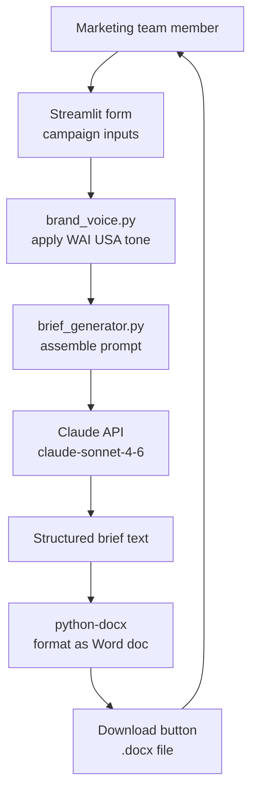

# WAI USA Marketing OS — AI Systems Design Case Study

---

## What it is
An AI-powered marketing operations system built for Women in AI USA.
Turns raw campaign inputs into structured marketing briefs, outreach
strategies, and impact reports — using Claude as the AI backbone.

**Problem it solves:** WAI USA's marketing team spent hours manually
drafting campaign briefs, partner outreach emails, and event impact
reports. Marketing OS automates the structured thinking and drafting,
letting the team focus on strategy and relationships instead of
document production.

**Live at:** Streamlit Cloud

---

## 1. Functional Requirements

1. Accept campaign inputs — event name, goals, audience, channels
2. Generate a structured campaign brief with Claude
3. Export brief as a downloadable DOCX file
4. Apply WAI USA brand voice consistently across all outputs
5. Support multiple modules — campaign briefs, partnership outreach,
   event impact reports (modular architecture)

**Users:** WAI USA marketing team — Suparna, Brenda, Madhumithaa,
and chapter leads who need structured campaign documents fast.

---

## 2. Non-Functional Requirements

| Requirement | Target |
|---|---|
| Response time | Brief generated in under 30 seconds |
| Brand consistency | Every output follows WAI USA brand voice |
| Usability | Non-technical team members can use it without training |
| Extensibility | New modules added without changing existing ones |
| Privacy | Campaign data not stored — session only |

---

## 3. Back-of-the-Envelope Calculations

| Metric | Estimate |
|---|---|
| Team size | 5-10 marketing team members |
| Briefs generated per week | 5-15 |
| Average tokens per brief | ~2,000 input + ~1,500 output |
| Anthropic API cost per brief | ~$0.02-0.05 |
| Monthly API cost estimate | Under $10 |

**Key insight:** At WAI USA's scale, cost is not the constraint —
speed and consistency are. Every brief that used to take 2 hours
now takes 2 minutes.

---

## 4. Architecture — What Happens Under the Hood

### Module 1: Campaign Intake & Brief Builder

```
User fills form:
  - Campaign name
  - Goals
  - Target audience
  - Channels (LinkedIn, Instagram, email)
  - Key messages
    ↓
brand_voice.py applies WAI USA brand fingerprint:
  - Tone: empowering, inclusive, professional
  - Voice: first-person plural, action-oriented
  - Anti-patterns: no corporate jargon, no passive voice
    ↓
brief_generator.py assembles prompt:
  "You are WAI USA's marketing strategist.
   Given these inputs: {campaign_inputs}
   Following this brand voice: {brand_voice}
   Generate a structured campaign brief with:
   - Executive summary
   - Goals and KPIs
   - Audience segments
   - Channel strategy
   - Content calendar outline
   - Success metrics"
    ↓
Claude API called (claude-sonnet-4-6)
    ↓
Structured brief returned
    ↓
python-docx converts to DOCX
    ↓
User downloads file
```

### Why Claude and not a template?
Templates produce rigid, generic outputs. Claude understands context —
a campaign for IWD needs different tone and structure than a Slack
community launch. Claude applies judgment, templates don't.

---

## 5. Trade-offs

### Trade-off 1: Session-only vs persistent storage

| | Session only (current) | Persistent storage |
|---|---|---|
| Privacy | High — data never stored | Lower — data stored on server |
| Cost | Zero storage cost | DB + hosting cost |
| History | No — user re-enters each time | Yes — view past briefs |
| Complexity | Simple | Requires auth + DB |
| **Choose when** | Small team, privacy priority | Larger team, history needed |

**Decision:** Session only for v1. Team is small, privacy matters,
no budget for DB hosting. V2 would add persistent storage.

### Trade-off 2: Monolithic app vs modular architecture

| | Single app | Modular (current) |
|---|---|---|
| Complexity | Low | Medium |
| Extensibility | Hard — adding modules touches everything | Easy — new module = new file |
| Team development | One person works on one thing | Multiple people work in parallel |
| **Choose when** | One tool, never expanding | Multiple tools, growing over time |

**Decision:** Modular — Partnership Copilot and Event-to-Impact Agent
are planned. Each module is a separate file under `modules/`.

### Trade-off 3: DOCX export vs PDF

| | DOCX | PDF |
|---|---|---|
| Editability | Yes — team can edit after download | No — read only |
| Formatting control | Exact | Exact |
| Marketing team preference | Editable drafts preferred | Final locked versions |
| **Choose when** | Draft documents | Final deliverables |

**Decision:** DOCX — briefs are working documents, not final reports.
Team needs to edit and customize after generation.

---

## 6. Data Modeling

No persistent database in v1. All state lives in Streamlit session.

**Session state structure:**
```python
st.session_state = {
    "campaign_name": str,
    "goals": str,
    "audience": str,
    "channels": list,
    "key_messages": str,
    "generated_brief": str,
    "docx_buffer": BytesIO
}
```

**V2 data model (planned):**

### campaigns
| Column | Type | Notes |
|---|---|---|
| id | UUID | primary key |
| user_id | UUID | who created it |
| campaign_name | VARCHAR | campaign name |
| inputs | JSON | all form inputs |
| brief_text | TEXT | generated brief |
| created_at | TIMESTAMP | when generated |

---

## 7. Deep Dives

### Deep dive 1: Brand voice fingerprint
**What makes WAI USA outputs consistent.**

`brand_voice.py` contains the WAI USA brand voice specification:

```
Tone: Empowering, inclusive, action-oriented
Audience: Women in AI, tech allies, corporate partners
Language:
  - Use "we" and "our community" not "the organization"
  - Lead with impact, not process
  - Avoid: "leverage", "synergy", "robust", "cutting-edge"
  - Prefer: "build", "grow", "connect", "create"
Format:
  - Short paragraphs, scannable headers
  - Concrete numbers over vague claims
  - End with clear call to action
```

This prompt injection ensures every module output sounds like WAI USA,
not generic AI output. Brand consistency is a system design decision,
not just a writing decision.

### Deep dive 2: Modular architecture
**How new modules are added without touching existing code.**

```
wai-usa-marketing-os/
├── app.py                    ← module selector only
├── pages/
│   └── module1_campaign_brief.py
│   └── module2_partnership.py    ← future
│   └── module3_event_impact.py   ← future
└── modules/
    └── module1_campaign_brief/
        ├── brief_generator.py
        └── brand_voice.py
    └── module2_partnership/      ← future
        ├── outreach_generator.py
        └── brand_voice.py
```

`app.py` is just a navigation shell. Each module owns its own logic,
prompts, and brand voice. Adding Module 2 requires zero changes to
Module 1 or `app.py`.

### Deep dive 3: DOCX generation
**How Claude's text output becomes a formatted Word document.**

```
Claude returns structured brief as markdown text
    ↓
brief_generator.py parses markdown sections:
  - ## headings → DOCX heading styles
  - bullet points → DOCX list items
  - bold text → DOCX bold runs
    ↓
python-docx builds document in memory (BytesIO)
    ↓
Streamlit serves as download button
    ↓
User downloads formatted .docx file
```

No file saved to disk — entire DOCX lives in memory and streamed
directly to the user. Stateless, no cleanup needed.

---

## 8. Final Design and Recap



**Key decisions recap:**
- Claude not templates → context-aware, not rigid
- Session-only storage → privacy, simplicity, zero cost
- Modular architecture → Partnership Copilot and Event Agent planned
- DOCX not PDF → team needs editable working documents
- Brand voice as code → consistency enforced at system level

---

## 9. Breadth — Monitoring, Testing, Deployments, Cost, Security

### Monitoring
- Streamlit Cloud dashboard — uptime and usage
- API key validity — if key expires, app breaks silently
- Brief quality — team reviews output manually each session

### Testing
- Manual testing per module before each release
- Brand voice review — does output sound like WAI USA?
- DOCX format check — does file open correctly, are styles applied?

### Deployments
- Streamlit Cloud — push to GitHub main branch → auto-deploys
- Zero downtime deploys — Streamlit handles this automatically
- API key entered per session — no secrets in deployment config

### Cost
| Component | Cost |
|---|---|
| Anthropic API | ~$0.02-0.05 per brief |
| Streamlit Cloud | Free tier |
| GitHub | Free |
| Total monthly | Under $10 at current usage |

### Security
- API key entered in UI per session — never stored or committed
- No user data persisted — session cleared on close
- No authentication needed — internal tool, shared team access
- DOCX downloaded locally — no files stored on server

---

## 10. Planned Modules

### Module 2 — Partnership Copilot (coming soon)
Input: partner organization profile, goals, context
Output: outreach strategy + personalized email draft

### Module 3 — Event-to-Impact Agent (coming soon)
Input: event data, attendance, outcomes
Output: sponsor-ready impact report with metrics and quotes

---

## Portfolio Talking Points
- Built and deployed a production AI tool used by a real nonprofit team
- Designed modular architecture — new modules added without touching existing code
- Brand voice as a system component — consistency enforced at prompt level, not style guide
- DOCX generation pipeline — Claude text → structured Word document in memory
- Real organizational impact — campaign briefs that took 2 hours now take 2 minutes
- Live at Streamlit Cloud, actively used by WAI USA marketing team