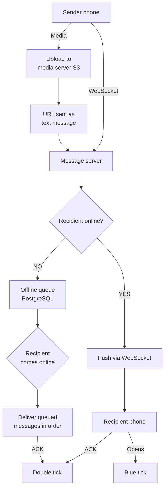
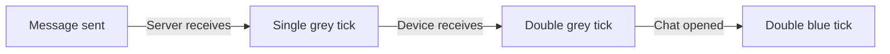
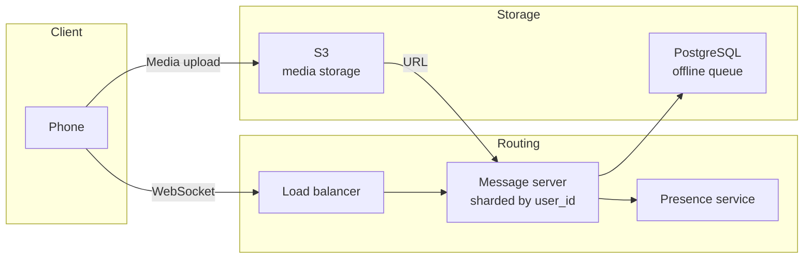

# WhatsApp — System Design Case Study

---

## 1. Functional Requirements

- Send and receive text messages, images, videos, voice notes
- Voice and video calls between users
- Group messaging — create groups, add/remove members
- Message delivery status — sent, delivered, read (tick system)
- Search across past messages and contacts

**Users:** 2 billion people globally across every type of network and device.

---

## 2. Non-Functional Requirements

| Requirement     | Target                                                |
| --------------- | ----------------------------------------------------- |
| Message latency | Delivered under 100ms on good network                 |
| Availability    | 99.99% uptime                                         |
| Scalability     | 100 billion messages per day                          |
| Privacy         | End-to-end encryption — WhatsApp never reads messages |
| Offline support | Messages held up to 30 days for offline users         |

---

## 3. Back-of-the-Envelope Calculations

| Metric                                  | Estimate                          |
| --------------------------------------- | --------------------------------- |
| Daily active users                      | 1 billion                         |
| Messages per day                        | 100 billion                       |
| Messages per second                     | 100B ÷ 86,400 = ~1.15 million/sec |
| Average message size                    | ~1KB (text)                       |
| Daily text storage                      | 100B × 1KB = ~100TB               |
| Media messages (30% of traffic)         | ~30 billion/day                   |
| Average media size                      | 1MB                               |
| Daily media storage                     | ~30 petabytes                     |
| Peak simultaneous WebSocket connections | ~300 million                      |

**Key insight:** Text is manageable (100TB/day). Media is the storage problem (30PB/day). Media must NOT travel through message servers.

---

## 4. High-Level Design Overview



**The two flows:**

**Online messaging:**

```
Sender → WebSocket → Message server
    → checks presence service → recipient online
    → push to recipient WebSocket → ACK → double tick
```

**Offline messaging:**

```
Sender → WebSocket → Message server
    → checks presence service → recipient offline
    → store in offline queue (PostgreSQL)
    → recipient reconnects → messages delivered in order
    → ACK → double tick
```

**Media flow:**

```
Photo encrypted on device
    → uploaded to S3 directly (bypasses message server)
    → S3 returns URL + encryption key
    → URL sent as text through normal message flow
    → recipient downloads from S3 directly
```

---

## 5. Trade-offs

### Trade-off 1: WebSocket vs HTTP polling

|                         | HTTP Polling             | WebSocket                    |
| ----------------------- | ------------------------ | ---------------------------- |
| Latency                 | Up to 1 second           | Milliseconds                 |
| Battery drain           | High — constant requests | Low — one open connection    |
| Server load at 1B users | 1B requests/sec          | 1B open connections          |
| **Choose when**         | Infrequent updates       | Real-time continuous updates |

**Decision:** WebSocket — messages must feel instant. 1 second delay on every message feels broken.

### Trade-off 2: Where to store media

|                     | Through message server                | Direct to S3                    |
| ------------------- | ------------------------------------- | ------------------------------- |
| Message server load | Massive — video files kill throughput | Zero — server only handles URLs |
| Latency             | High — upload + route + download      | Low — direct transfer           |
| Encryption          | Server sees content                   | Client encrypts before upload   |
| **Choose when**     | Small files only                      | Any media at scale              |

**Decision:** Direct to S3 — message server handles only tiny text messages.

### Trade-off 3: Offline queue storage

|                  | Redis                              | PostgreSQL                  |
| ---------------- | ---------------------------------- | --------------------------- |
| Speed            | Faster                             | Slower                      |
| Durability       | Data lost on restart (without AOF) | Durable — survives crashes  |
| Message ordering | Harder to guarantee                | Easy with sequence numbers  |
| **Choose when**  | Ephemeral, speed-critical          | Messages must never be lost |

**Decision:** PostgreSQL — losing an offline message is unacceptable.

---

## 6. Data Modeling

### messages

| Column       | Type      | Notes                          |
| ------------ | --------- | ------------------------------ |
| id           | UUID      | primary key                    |
| sender_id    | UUID      | who sent it                    |
| recipient_id | UUID      | who receives it                |
| content      | BLOB      | encrypted — server cannot read |
| status       | VARCHAR   | sent/delivered/read            |
| created_at   | TIMESTAMP | when sent                      |
| delivered_at | TIMESTAMP | when delivered                 |

### offline_queue

| Column       | Type      | Notes                  |
| ------------ | --------- | ---------------------- |
| id           | UUID      | queue entry ID         |
| recipient_id | UUID      | who to deliver to      |
| message_id   | UUID      | foreign key → messages |
| queued_at    | TIMESTAMP | when queued            |
| expires_at   | TIMESTAMP | 30 days after queued   |

### media

| Column      | Type      | Notes                              |
| ----------- | --------- | ---------------------------------- |
| id          | UUID      | media ID                           |
| uploader_id | UUID      | who uploaded                       |
| s3_url      | TEXT      | location in object storage         |
| size_bytes  | INTEGER   | file size                          |
| mime_type   | VARCHAR   | image/video/audio                  |
| expires_at  | TIMESTAMP | deleted from server after download |

### groups

| Column     | Type      | Notes        |
| ---------- | --------- | ------------ |
| id         | UUID      | group ID     |
| name       | VARCHAR   | group name   |
| created_by | UUID      | creator      |
| created_at | TIMESTAMP | when created |

### group_members

| Column    | Type      | Notes                |
| --------- | --------- | -------------------- |
| group_id  | UUID      | foreign key → groups |
| user_id   | UUID      | foreign key → users  |
| role      | VARCHAR   | admin/member         |
| joined_at | TIMESTAMP | when they joined     |

---

## 7. Deep Dives

### Deep dive 1: The tick system

Each tick is a separate ACK flowing back through the system.



**What triggers each tick:**

- Single tick → message server ACKs receipt
- Double tick → recipient device ACKs receipt
- Blue tick → recipient app sends read receipt when chat opened

**Privacy setting:** Users can disable read receipts — blue tick never sent. But delivery receipt (double grey) cannot be disabled.

### Deep dive 2: End-to-end encryption

**WhatsApp uses the Signal protocol.**

```
Keys generated on your device — WhatsApp never has them
    ↓
Message encrypted before leaving your phone
    ↓
Server routes encrypted blob — cannot read content
    ↓
Recipient device decrypts using private key
    ↓
Even WhatsApp employees cannot read your messages
```

**Group message encryption challenge:**
In a group of 256 members — sender encrypts the message 256 times, once with each member's public key. Server routes 256 encrypted copies. This is why large groups can be slow.

### Deep dive 3: Presence service

**Powers "last seen" and online indicators.**

```
Phone connects → presence service marks user online
Phone disconnects → marked offline + timestamp recorded
Other users request status → presence service responds
```

**Scale challenge:** 1 billion users, each checking presence of their contacts. Presence is eventually consistent — slight delay in "online" indicator is acceptable.

### Deep dive 4: Sharding strategy

**1 billion users can't fit on one message server.**

- Shard by `user_id` using consistent hashing
- Each user mapped to a specific message server
- Sender's message routed to recipient's assigned server
- Adding servers only moves a small slice of users

### Deep dive 5: WebSocket reconnection

**What happens when your phone switches from WiFi to 4G:**

```
WiFi drops → WebSocket connection dies
    ↓
Client detects no pong response to ping
    ↓
Client reconnects → new WebSocket to same server
    (consistent hashing ensures same server)
    ↓
Server checks offline queue
    ↓
Delivers any messages that arrived during disconnect
```

---

## 8. Final Design and Recap



**Key decisions recap:**

- WebSocket → real-time delivery, battery efficient
- Media to S3 directly → message server never sees large files
- PostgreSQL for offline queue → messages never lost
- Signal protocol → true end-to-end encryption
- Consistent hashing → user always reaches same server
- Presence service → separate from message routing

---

## 9. Breadth — Monitoring, Testing, Deployments, Cost, Security

### Monitoring

- Message delivery latency — p50, p95, p99
- Offline queue depth — messages waiting per user
- WebSocket connection count — active users
- Media upload/download success rate
- Presence service accuracy

### Testing

- Unit tests on encryption/decryption logic
- Integration tests on full message flow
- Load tests simulating 1.15M messages/second
- Chaos engineering — kill random servers, verify no message loss

### Deployments

- Message servers stateless where possible — sessions in Redis
- Rolling deployments — no downtime
- Feature flags — new encryption versions rolled out gradually

### Cost

| Component                | Cost driver                                   |
| ------------------------ | --------------------------------------------- |
| Message servers          | Compute — 1.15M msg/sec requires many servers |
| S3 media storage         | 30PB/day — largest cost                       |
| PostgreSQL offline queue | Moderate — messages deleted after delivery    |
| CDN for media            | Significant — media downloaded globally       |

### Security

- End-to-end encryption — Signal protocol
- Keys never leave user devices
- Media encrypted before upload
- No message content stored on servers after delivery
- Metadata (who messaged who, when) stored but not content
