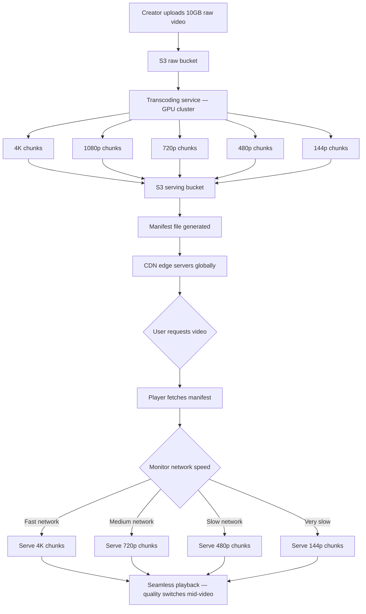
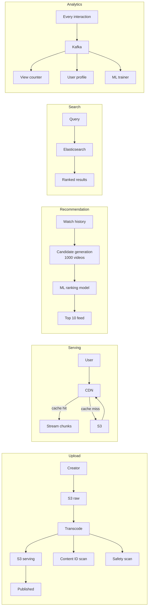

# YouTube — System Design Case Study

## What it is

The world's largest video platform with 2 billion daily active users.
Core product: upload, discover, and watch videos of any length.
Second largest search engine in the world.

---

## Functional requirements

1. Upload video — creator uploads, video processed and published
2. Watch and interact — play, seek, like, comment, chapters
3. Recommendations — personalized homepage feed
4. Search — find videos by keyword, topic, creator

## Non-functional requirements

1. Low latency — video starts under 2 seconds on any network
2. Scalability — 500 hours of video uploaded every minute
3. Reliability — 99.99% uptime, 2 billion users depend on it
4. Security — content ID, age restrictions, private videos
5. SEO — videos indexed by Google, discoverable externally

---

## Scale estimates

| Metric                            | Estimate        |
| --------------------------------- | --------------- |
| Daily active users                | 2 billion       |
| Hours uploaded per minute         | 500 hours       |
| Hours uploaded per day            | 30,000 hours    |
| Average raw video size            | 2GB per hour    |
| Daily raw upload storage          | 60 TB           |
| After transcoding (8 formats)     | 480 TB per day  |
| Total YouTube storage (estimated) | 1+ exabyte      |
| Videos watched per day            | 1 billion hours |

---

## How video streaming works — HLS

Every uploaded video is split into chunks of 10 seconds each.
Each chunk exists in 8 quality versions.
1 hour video = 360 chunks × 8 qualities = 2,880 files in S3
A manifest file tells the player what chunks exist and at
what quality levels. The player monitors download speed every
10 seconds and switches quality automatically.

**Adaptive Bitrate Streaming (ABR):**

- Fast network → 4K chunks served
- Slow network → 480p chunks served
- Quality switches mid-video → seamless, no buffering

**Seeking (jumping to minute 45):**

- Player requests chunk 270 directly
- Downloads forward from there
- Chunks before minute 45 never downloaded
- Works because video is chunked, not one big file

---

## The 5 pipelines

### Pipeline 1 — Upload

Creator uploads raw video (2GB-10GB)
↓
Raw file stored in S3 (upload bucket)
↓
Transcoding job triggered (async background job)
↓
GPU cluster converts to 8 formats:
4K, 1080p, 720p, 480p, 360p, 240p, 144p, audio only
↓
Each chunk stored in S3 (serving bucket)
↓
Manifest file generated (tells player what chunks exist)
↓
Content ID scan — copyright check
↓
Safety scan — policy violation check
↓
Thumbnail generated
↓
Elasticsearch indexed — video now searchable
↓
Video published to feed

### Pipeline 2 — Serving (watching)

User clicks video
↓
Player fetches manifest file from CDN
↓
Player requests first chunk (monitors network speed)
↓
CDN cache hit → chunk served instantly
CDN cache miss → fetch from S3 → cache at edge → serve
↓
Player adapts quality every 10 seconds based on speed
↓
User seeks to minute 45 → player requests chunk 270 directly
↓
Playback continues from new position

### Pipeline 3 — Recommendation

Same two-stage approach as TikTok:
Stage 1 — Candidate generation
Fetch watch history, likes, subscriptions
Pull 1000 candidate videos
↓
Stage 2 — Ranking
ML model scores 1000 candidates
Signals: watch time, completion rate,
likes, comments, CTR, recency
↓
Top videos returned to homepage feed

**Key difference from TikTok:**
YouTube optimizes for **watch time** not completion rate.
A 10 minute video watched for 8 minutes beats a 30 second
video watched fully. Longer watch time = more ad revenue.

### Pipeline 4 — Analytics

Every interaction → event fired async
↓
Kafka topic: "video-events"
↓
3 consumer groups:

1. View counter → increments view count
2. User profile → updates watch history
3. Recommendation trainer → feeds ML model
   ↓
   Aggregated into YouTube Studio analytics

### Pipeline 5 — Search

User types "how to cook pasta"
↓
Query sent to Elasticsearch
↓
Elasticsearch finds relevant videos:

- Matches title, description, tags, transcript
- Handles typos (fuzzy matching)
- Ranks by relevance + view count + recency
  ↓
  Results returned in milliseconds
  ↓
  Displayed with thumbnails, duration, view count

---

## Key components

### Transcoding service

Most expensive part of YouTube's infrastructure.
GPU clusters run 24/7 converting uploaded videos.
A 4K 3-hour video takes 30-60 minutes to transcode fully.
Why GPU not CPU? — video encoding is parallelizable,
GPUs handle it 10-100x faster than CPUs.

### CDN (Content Delivery Network)

Videos cached at edge servers globally.
User in Tokyo gets chunks from Tokyo CDN.
Most popular videos cached everywhere.
Less popular videos fetched from S3 on demand.
YouTube uses Google's own CDN infrastructure globally.

### Content ID system

Every uploaded video scanned against database of
copyrighted content — music, movies, TV shows.
Match found → video monetized by rights holder or taken down.
Runs on ML models trained on millions of copyrighted works.

### Elasticsearch

Indexes every video's title, description, tags, transcript.
Powers search across billions of videos instantly.
Handles typos, synonyms, related terms automatically.
Why not PostgreSQL? — full text search at billion scale
needs a dedicated search engine, not a relational DB.

---

## Data model

### videos

| Column           | Type      | Notes                        |
| ---------------- | --------- | ---------------------------- |
| id               | UUID      | unique video ID              |
| creator_id       | UUID      | who uploaded                 |
| title            | TEXT      | video title                  |
| description      | TEXT      | full description             |
| duration_seconds | INTEGER   | video length                 |
| manifest_url     | TEXT      | HLS manifest location        |
| status           | VARCHAR   | processing/published/removed |
| created_at       | TIMESTAMP | upload time                  |

### video_chunks

| Column           | Type    | Notes                |
| ---------------- | ------- | -------------------- |
| video_id         | UUID    | foreign key → videos |
| chunk_number     | INTEGER | sequence position    |
| quality          | VARCHAR | 4k/1080p/720p etc    |
| s3_url           | TEXT    | chunk location in S3 |
| duration_seconds | INTEGER | chunk length         |

### video_events

| Column          | Type      | Notes              |
| --------------- | --------- | ------------------ |
| id              | UUID      | event ID           |
| user_id         | UUID      | who watched        |
| video_id        | UUID      | what they watched  |
| watch_seconds   | INTEGER   | how long           |
| completion_rate | FLOAT     | percentage watched |
| event_type      | VARCHAR   | watch/like/comment |
| created_at      | TIMESTAMP | when               |

---

## How YouTube differs from TikTok

| Aspect            | TikTok               | YouTube                  |
| ----------------- | -------------------- | ------------------------ |
| Video length      | 15-60 seconds        | Minutes to hours         |
| Primary discovery | Algorithmic feed     | Search + recommendations |
| Key signal        | Completion rate      | Watch time               |
| Streaming         | Pre-fetch next video | HLS adaptive bitrate     |
| Seeking           | Simple               | Critical feature         |
| Transcoding       | Seconds              | Minutes to hours         |
| Search            | Secondary            | Core product             |
| CDN strategy      | Pre-load             | On-demand chunks         |
| Daily new storage | ~2.5 PB              | ~480 TB                  |

---

## Failure modes

| Failure             | User impact            | Mitigation                  |
| ------------------- | ---------------------- | --------------------------- |
| Transcoding fails   | Video stuck processing | Retry queue, alert creator  |
| CDN goes down       | Buffering, slow load   | Multiple CDN providers      |
| Elasticsearch down  | Search broken          | Cached results, fallback    |
| Recommendation slow | Stale feed served      | Cache last known feed       |
| S3 unavailable      | Videos don't load      | Multi-region S3 replication |

## Architecture Diagrams

### HLS Adaptive Streaming — how YouTube plays video

### The 5 pipelines — how YouTube works end to end

