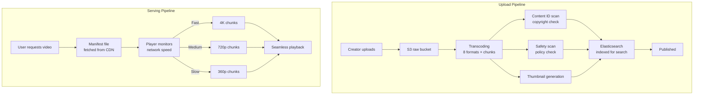
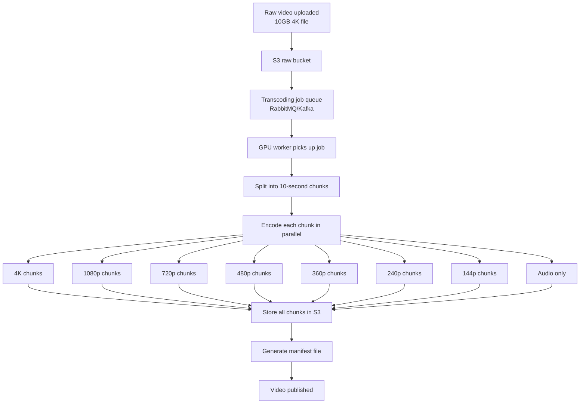
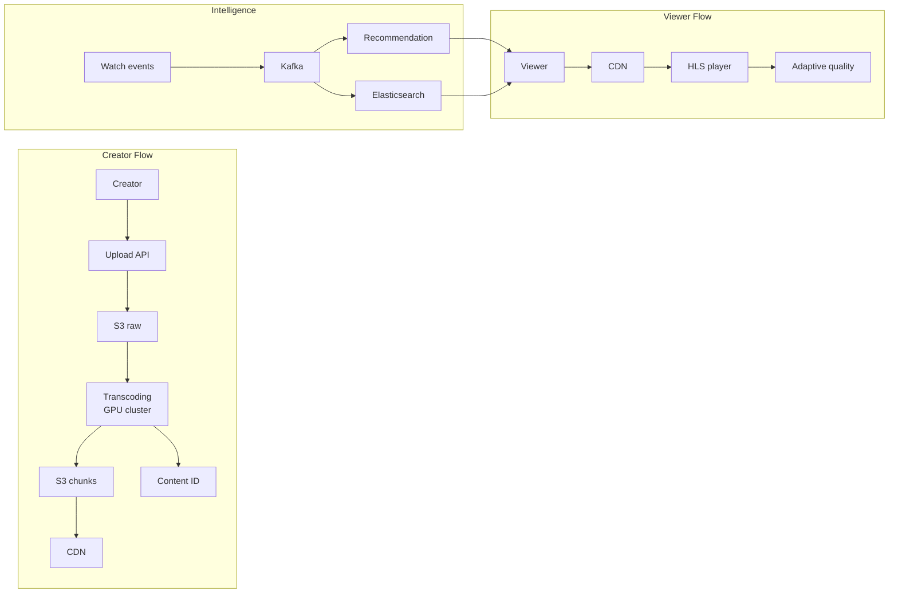

# YouTube — System Design Case Study

---

## 1. Functional Requirements

- Upload videos of any length — minutes to hours
- Watch videos with adaptive quality based on network speed
- Interact — like, comment, share, subscribe
- Search videos by keyword, topic, creator
- Personalized homepage recommendations

**Users:** 2 billion daily active users. Both creators and viewers. Second largest search engine in the world.

---

## 2. Non-Functional Requirements

| Requirement         | Target                                            |
| ------------------- | ------------------------------------------------- |
| Video start latency | Under 2 seconds on any network                    |
| Upload processing   | Video available within 30 minutes of upload       |
| Scalability         | 500 hours of video uploaded every minute          |
| Availability        | 99.99% uptime                                     |
| Search latency      | Results in under 500ms                            |
| Storage             | Indefinite — videos never deleted unless violated |

---

## 3. Back-of-the-Envelope Calculations

| Metric                              | Estimate                  |
| ----------------------------------- | ------------------------- |
| Daily active users                  | 2 billion                 |
| Hours uploaded per minute           | 500 hours                 |
| Hours uploaded per day              | 500 × 60 = 30,000 hours   |
| Average raw video size              | 2GB per hour              |
| Daily raw upload storage            | 30,000 × 2GB = 60TB       |
| Transcoding formats                 | 8 per video               |
| Daily storage after transcoding     | 60TB × 8 = 480TB          |
| Total YouTube storage (estimated)   | 1+ exabyte                |
| Videos watched per day              | 1 billion hours           |
| Recommendation decisions per second | 1B ÷ 86,400 = ~11,600/sec |

**Key insight:** 480TB new storage per day. Transcoding a 4K 3-hour video takes 30-60 minutes on GPU. Processing pipeline must handle 30,000 hours of video per day continuously.

---

## 4. High-Level Design Overview



**HLS — How adaptive streaming works:**

```
1 hour video = 360 chunks × 10 seconds each
Each chunk exists in 8 quality versions

Manifest file tells player:
  - What chunks exist
  - Available quality levels
  - URL of each chunk

Player downloads chunk by chunk:
  - Monitors download speed every 10 seconds
  - Switches quality up or down automatically
  - User seeks to minute 45 → requests chunk 270 directly
```

---

## 5. Trade-offs

### Trade-off 1: HLS vs DASH streaming

|                   | HLS (HTTP Live Streaming)     | DASH (Dynamic Adaptive) |
| ----------------- | ----------------------------- | ----------------------- |
| Support           | Native on Apple devices       | Better on Android/web   |
| Chunk format      | .ts files                     | .mp4 segments           |
| Latency           | Slightly higher               | Slightly lower          |
| Industry adoption | Dominant                      | Growing                 |
| **YouTube uses**  | Both — serves based on device |

**Decision:** Support both formats. Transcode into HLS for Apple devices, DASH for Android and web.

### Trade-off 2: CDN strategy for long-tail videos

|                        | Cache everything        | Cache hot videos only      |
| ---------------------- | ----------------------- | -------------------------- |
| Storage cost           | Extremely high          | Manageable                 |
| Cache hit rate         | Near 100%               | ~80% for popular content   |
| Cold video performance | Instant                 | Fetches from S3 on miss    |
| **Reality**            | Impossible at 1 exabyte | What YouTube actually does |

**Decision:** Cache hot videos at CDN edge. Long-tail videos served from S3 on demand. Top 20% of videos account for 80% of views — cache those aggressively.

### Trade-off 3: Synchronous vs async transcoding

|                    | Synchronous            | Asynchronous        |
| ------------------ | ---------------------- | ------------------- |
| Video availability | Immediate after upload | 5-30 minutes delay  |
| Upload experience  | Blocked waiting        | Returns immediately |
| System complexity  | Simple                 | Requires job queue  |
| Failure handling   | Retry blocks upload    | Retry independently |
| **Choose when**    | Small files            | Large video files   |

**Decision:** Async — creator uploads, gets confirmation immediately, video appears after transcoding completes. This is the standard for video platforms.

---

## 6. Data Modeling

### videos

| Column           | Type      | Notes                        |
| ---------------- | --------- | ---------------------------- |
| id               | UUID      | unique video ID              |
| creator_id       | UUID      | who uploaded                 |
| title            | TEXT      | video title                  |
| description      | TEXT      | full description             |
| duration_seconds | INTEGER   | video length                 |
| manifest_url     | TEXT      | HLS manifest location in CDN |
| status           | VARCHAR   | processing/published/removed |
| created_at       | TIMESTAMP | upload time                  |

### video_chunks

| Column           | Type    | Notes                             |
| ---------------- | ------- | --------------------------------- |
| video_id         | UUID    | foreign key → videos              |
| chunk_number     | INTEGER | sequence position                 |
| quality          | VARCHAR | 4k/1080p/720p/480p/360p/240p/144p |
| s3_url           | TEXT    | chunk location in S3              |
| duration_seconds | INTEGER | chunk length                      |

### video_events

| Column          | Type      | Notes                    |
| --------------- | --------- | ------------------------ |
| id              | UUID      | event ID                 |
| user_id         | UUID      | who watched              |
| video_id        | UUID      | what they watched        |
| watch_seconds   | INTEGER   | how long                 |
| completion_rate | FLOAT     | percentage watched       |
| event_type      | VARCHAR   | watch/like/comment/share |
| created_at      | TIMESTAMP | when                     |

### channels

| Column           | Type      | Notes        |
| ---------------- | --------- | ------------ |
| id               | UUID      | channel ID   |
| user_id          | UUID      | owner        |
| name             | VARCHAR   | channel name |
| subscriber_count | INTEGER   | cached count |
| created_at       | TIMESTAMP | when created |

---

## 7. Deep Dives

### Deep dive 1: Transcoding pipeline

**Most expensive part of YouTube's infrastructure.**



**Why GPU not CPU:**
Video encoding is parallelizable — each chunk encoded independently. GPUs handle 10-100x faster than CPUs for this workload.

**Processing time estimates:**

- 5 minute 1080p video → ~2 minutes
- 1 hour 1080p video → ~20 minutes
- 3 hour 4K video → ~60 minutes

### Deep dive 2: Seeking — jumping to minute 45

**Why seeking works instantly with chunked architecture:**

```
User clicks minute 45 timestamp
    ↓
Player calculates: 45 min × 60 sec ÷ 10 sec/chunk = chunk 270
    ↓
Player requests chunk_270_720p.ts from CDN
    ↓
CDN serves chunk 270 (and pre-fetches 271, 272)
    ↓
Playback starts from minute 45 instantly
    ↓
Chunks 1-269 never downloaded
```

**Why this matters at scale:**
Users watch on average 40% of a video. Without chunking — 60% of bandwidth wasted downloading unwatched content. With chunking — only watched portions downloaded.

### Deep dive 3: Content ID system

**How YouTube detects copyright violations.**

```
Rights holder submits reference file\n(song, movie clip, TV show)
    ↓
YouTube stores audio/video fingerprint in Content ID database
    ↓
Every uploaded video scanned against fingerprint database
    ↓
Match found above threshold
    ↓
Rights holder chooses:
  1. Monetize — ads on video, revenue to rights holder
  2. Block — video removed in their territory
  3. Track — just monitor view counts
```

**Scale:** Content ID database contains 800 million reference files. Every video scanned in minutes using ML fingerprinting.

### Deep dive 4: Search ranking

**How YouTube decides which video appears first for "system design interview."**

Signals used:

- **Relevance** — title, description, tags match query
- **Engagement** — click-through rate, watch time, likes
- **Recency** — newer videos boosted for trending topics
- **Personalization** — your watch history influences results
- **Authority** — channel subscriber count, video count

**Why Elasticsearch:**
PostgreSQL `LIKE '%system design%'` = full table scan across 800M videos. Elasticsearch inverted index = milliseconds regardless of catalog size.

### Deep dive 5: Recommendation vs TikTok

**YouTube optimizes for watch time, not completion rate.**

| Signal              | TikTok weight      | YouTube weight |
| ------------------- | ------------------ | -------------- |
| Completion rate     | Very high          | Medium         |
| Total watch minutes | Low (short videos) | Very high      |
| Click-through rate  | Medium             | High           |
| Likes/comments      | Medium             | Medium         |
| Rewatch             | High               | Low            |

A 10-minute video watched for 8 minutes beats a 30-second video watched fully on YouTube. More watch time = more ads = more revenue.

---

## 8. Final Design and Recap



**Key decisions recap:**

- HLS/DASH → adaptive bitrate, seamless quality switching
- Chunked video → seeking works instantly, no wasted bandwidth
- Async transcoding → creator gets confirmation immediately
- GPU clusters → transcode 30,000 hours/day of video
- Content ID → rights holders protected automatically
- Elasticsearch → search across 800M videos in milliseconds
- Cache hot 20% of videos → covers 80% of traffic

---

## 9. Breadth — Monitoring, Testing, Deployments, Cost, Security

### Monitoring

- Transcoding queue depth — how many videos waiting
- CDN cache hit rate — % served from edge vs S3
- Video start latency — p50, p95, p99
- Recommendation CTR — % of recommended videos clicked
- Content ID false positive rate — legitimate videos wrongly flagged

### Testing

- Load tests on transcoding pipeline — 500 hours/minute sustained
- Seeking accuracy — seek to any timestamp, verify correct chunk served
- Adaptive bitrate tests — simulate network degradation
- Content ID accuracy benchmarks — compare to human review

### Deployments

- Transcoding workers auto-scale based on queue depth
- CDN config changes rolled out gradually — 1% → 10% → 100%
- Recommendation model updated weekly with new training data

### Cost

| Component     | Cost driver                                     |
| ------------- | ----------------------------------------------- |
| S3 storage    | 480TB/day new content — largest ongoing cost    |
| CDN           | Serving 1 billion hours of video daily globally |
| GPU clusters  | Transcoding + recommendation inference          |
| Elasticsearch | Indexing + serving 800M video search queries    |
| Content ID    | ML inference on every upload                    |

**Cost optimization:**

- Compress old videos to cheaper storage tiers
- Delete raw uploads after transcoding completes
- Cache hot 20% at CDN, serve rest from S3 on demand
- Use spot/preemptible GPU instances for transcoding

### Security

- Content ID — automatic copyright enforcement
- Age restriction — ML detects and gates mature content
- CSAM detection — mandatory scanning, reported to authorities
- Creator verification — prevents impersonation
- Privacy — watch history not shared with third parties
- GDPR — right to delete watch history and uploaded content
